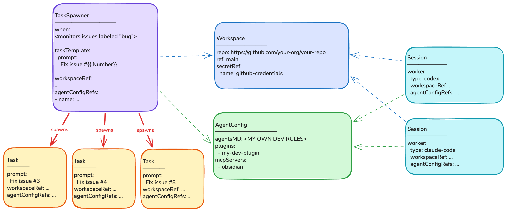

<h1 align="center">Kelos</h1>

<p align="center"><strong>Run and orchestrate coding agents on Kubernetes.</strong></p>

<p align="center">
  <a href="https://github.com/kelos-dev/kelos/actions/workflows/ci.yaml"></a>
  <a href="https://github.com/kelos-dev/kelos/releases/latest"></a>
  <a href="https://github.com/kelos-dev/kelos"></a>
  <a href="https://github.com/kelos-dev/kelos"></a>
  <a href="LICENSE"></a>
</p>

<p align="center">
  <a href="#how-it-works">How It Works</a> &middot;
  <a href="#quick-start">Quick Start</a> &middot;
  <a href="#usage">Usage</a> &middot;
  <a href="#documentation">Documentation</a> &middot;
  <a href="CONTRIBUTING.md">Contributing</a>
</p>

Kelos turns coding agents into Kubernetes workloads. Give an agent a goal and
Kelos provides the repository, credentials, tools, compute, and workflow needed
to complete it.

Use Kelos for one-off tasks, persistent conversations, event-driven
automation, pipelines, and parallel work across many repositories. It supports
Claude Code, OpenAI Codex, Google Gemini, OpenCode, Cursor, and
[custom agent images](docs/agent-image-interface.md).

<p align="center">
  
  <br>
  <a href="#use-the-kelos-console">Set up the Kelos Console</a>
</p>

## Why Kelos?

- Run agents in isolated Kubernetes workloads instead of on developer laptops.
- Reuse the same repositories, instructions, skills, and tools across agents.
- Keep interactive Sessions alive and reconnect from terminal or web clients.
- Trigger work from GitHub, Jira, Linear, cron schedules, or generic webhooks.
- Observe, limit, and operate agent workloads with familiar Kubernetes controls.

## How It Works



The controller turns Kelos resources into Pods, Jobs, and StatefulSets.

### Core Primitives

| Resource | Purpose |
| --- | --- |
| `Task` | Run one agent job |
| `TaskPipeline` | Manage a DAG of dependent and parallel Tasks |
| `Session` | Keep an interactive agent conversation running |
| `Workspace` | Give agents a Git repository |
| `AgentConfig` | Share instructions, skills, plugins, and MCP servers |
| `TaskSpawner` | Create Tasks from events or schedules |
| `SessionSpawner` | Create Sessions from GitHub webhooks |
| `WorkerPool` | Maintain reusable agent workers |

Task status records useful results such as branches, commits, pull requests,
and token usage. The resources remain ordinary Kubernetes objects, so advanced
users can review them, keep them in Git, or manage them with existing delivery
tools.

See the [API and CLI reference](docs/reference.md) for the underlying fields and
commands.

## Quick Start

You need a Kubernetes 1.28+ cluster with
[cert-manager](https://cert-manager.io/docs/installation/) installed.

Install the CLI:

```bash
curl -fsSL https://raw.githubusercontent.com/kelos-dev/kelos/main/hack/install.sh | bash
```

Homebrew and source installs are also available:

```bash
brew tap kelos-dev/tap
brew install kelos

# Or:
go install github.com/kelos-dev/kelos/cmd/kelos@latest
```

Install Kelos:

```bash
kelos install
```

For Helm installations and upgrades, see the
[chart documentation](internal/manifests/charts/kelos/README.md).

Install the first-party Kelos skill in your coding agent:

```bash
npx skills add kelos-dev/kelos
```

The skill teaches your agent how to configure Kelos, create the right
resources, operate workloads, and troubleshoot failures. You can now use Kelos
without writing configuration files or assembling CLI commands by hand.

## Usage

### Use the Kelos skill

Ask your coding agent to use the `/kelos` skill. Describe the outcome you want,
the agent provider, and the repository; the skill handles the Kelos resources
and commands.

#### Set up a repository

```text
Using the /kelos skill, configure Kelos on my current cluster for OpenAI Codex
and https://github.com/your-org/your-repo.

Name the Workspace my-workspace. Use my existing local Codex OAuth credentials.
Ask before creating or replacing any Kubernetes Secret, then verify the setup
with a small read-only Task.
```

#### Create your first Task

```text
Using the /kelos skill, create a Codex Task in my-workspace with this
prompt: "Add a hello world program in Python."

Run the Task, watch it until it finishes, and show me the logs and result.
```

#### Start a persistent session

```text
Using the /kelos skill, create a persistent Codex Session named my-session for
my-workspace, then connect me to it.
```

#### Automate issue fixes

```text
Using the /kelos skill, create a webhook-based TaskSpawner for GitHub issues
labeled "agent-ready" in your-org/your-repo.

Each task should reproduce the issue, add a tested fix, and open a pull request
without merging it. Limit concurrency to 3 and runtime to 1 hour. Show me the
resources before applying them.
```

#### Build your own self-development setup

```text
Using the /kelos skill, use this repository's self-development/ setup as a
reference and create a minimal self-development setup for
https://github.com/your-org/your-repo.

Start with issue pick-up and pull request review. Reuse shared configuration,
prefer GitHub webhooks, and show me the resources before applying them.
```

#### Troubleshoot a failed workload

```text
Using the /kelos skill, investigate why Task my-task failed in the default
namespace. Do not print Secret values. Fix configuration problems if it is safe
to do so, then retry and watch the Task.
```

These prompts are starting points. Your agent will inspect the cluster and ask
for missing choices or credentials when needed.

Use scoped credentials, protected branches, and workload limits for autonomous
agents.

### Use the CLI directly

Initialize `~/.kelos/config.yaml`, then add your agent credentials using the
comments in the generated file:

```bash
kelos init
```

#### Create a Workspace

```bash
kelos create workspace my-workspace \
  --repo https://github.com/your-org/your-repo.git \
  --ref main
```

#### Create a Task

Create and watch a Task in that Workspace:

```bash
kelos run \
  --workspace my-workspace \
  --prompt "Add a hello world program in Python" \
  --watch
```

The command prints the generated Task name. Use it to stream the agent logs:

```bash
kelos logs TASK_NAME -f
```

#### Start a Session

Replace the credential placeholder in the
[Session example](examples/16-session/), then apply and connect to it:

```bash
kubectl apply -f examples/16-session/
kelos session connect interactive-review
```

##### Use the Kelos Console

To inspect Kelos resources and create, organize, and chat with Sessions in a
browser, enable the optional Console server. Follow the
[Kelos Console guide](internal/manifests/charts/kelos/README.md#kelos-console)
to configure its shared token and access the cluster-internal web application.

See the [configuration reference](docs/reference.md#configuration) for other
agents and authentication options.

## What You Can Build

- **Developer-guided work:** reconnect to a long-running Session from a terminal
  or browser.
- **Event-driven workers:** turn issues, pull requests, webhooks, and schedules
  into agent Tasks.
- **Agent pipelines:** sequence implementation, review, testing, and delivery.
- **Repository fleets:** fan out the same change across many services.
- **Self-development loops:** let specialized agents triage, implement, review,
  and maintain a project continuously.

Kelos uses Kelos to develop itself. The
[self-development setup](self-development/README.md) shows the agents and
workflows running the project.

## Documentation

| Need | Documentation |
| --- | --- |
| Resource fields and CLI commands | [Reference](docs/reference.md) |
| Ready-to-apply patterns | [Examples](examples/) |
| GitHub, Jira, CI, and webhook connections | [Integration guide](docs/integration.md) |
| Console and interactive Sessions | [Session example](examples/16-session/) and [Console guide](internal/manifests/charts/kelos/README.md#kelos-console) |
| Custom agent containers | [Agent image interface](docs/agent-image-interface.md) |
| Helm installation and upgrades | [Chart documentation](internal/manifests/charts/kelos/README.md) |
| Contributing | [Contributing guide](CONTRIBUTING.md) |

## Development

Use the project Makefile:

```bash
make update
make verify
make test
make test-integration
make build
```

See the [contributing guide](CONTRIBUTING.md) for development setup and pull
request requirements.

## License

[Apache License 2.0](LICENSE)
