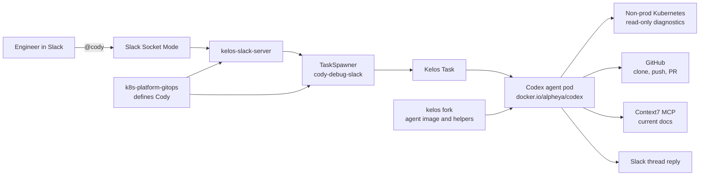
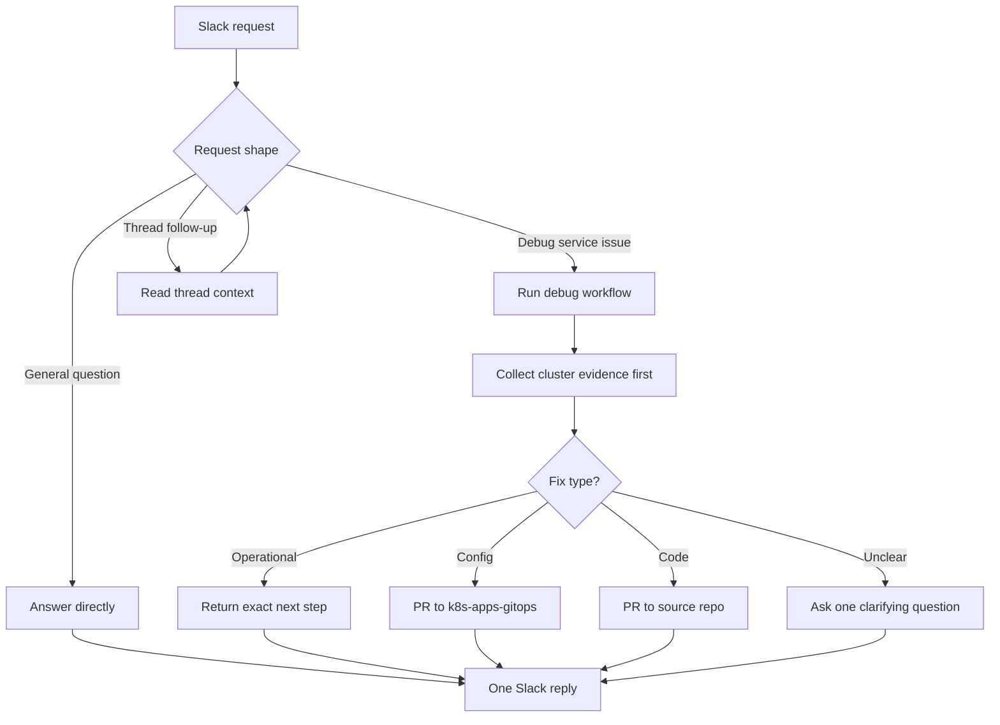
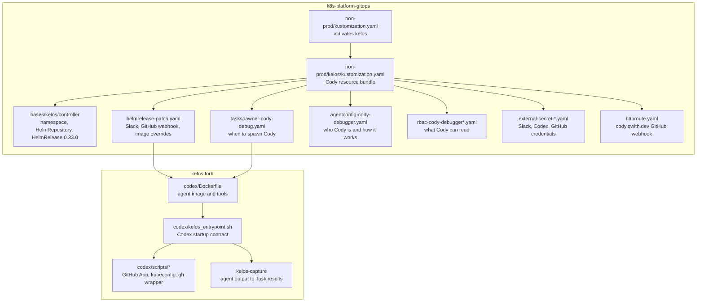
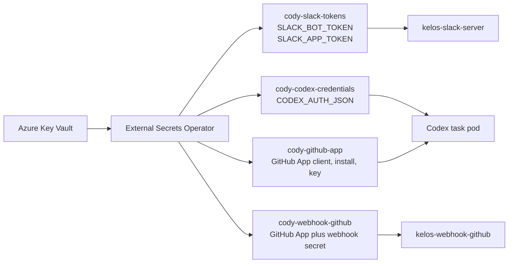
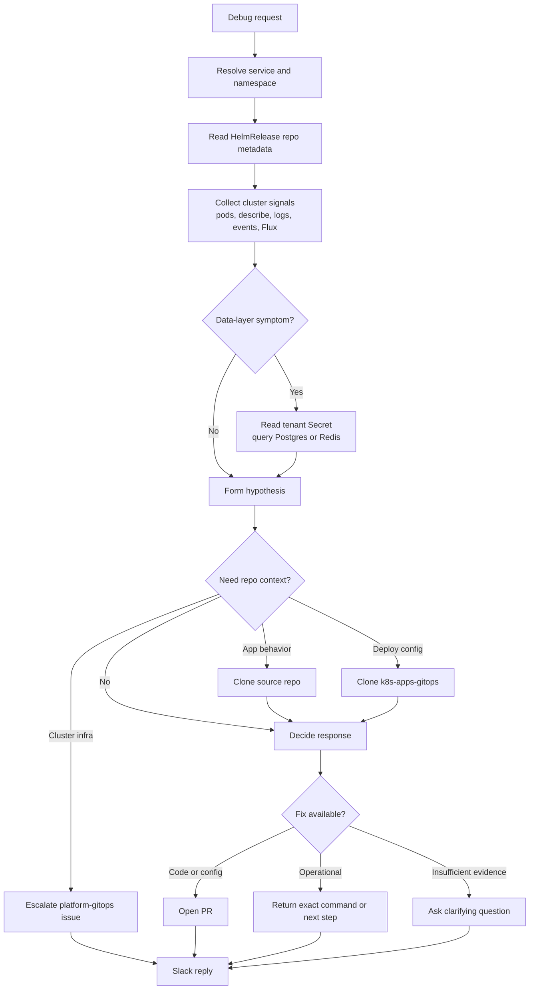
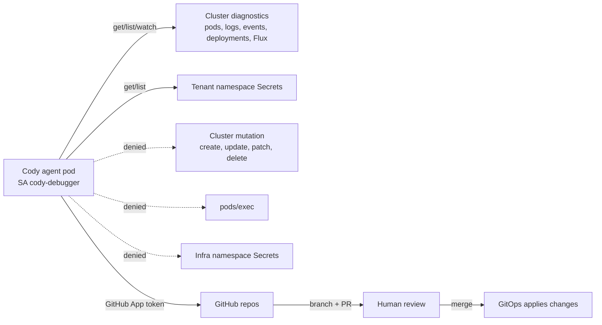

# Cody MVP Specification

## Status

Draft, reverse-engineered from the current Alpheya Cody deployment and fork changes as of 2026-05-18.

This document intentionally describes the Alpheya-specific Cody product layer. It does not attempt to respec upstream Kelos itself except where Kelos behavior is required to understand Cody.

## Summary

Cody is an internal, Slack-triggered, autonomous background agent for non-prod platform debugging and small reviewable fixes.

At MVP, a user mentions `@cody` in Slack with a service issue or platform question. Kelos creates a one-off Codex task pod. That pod runs with Cody-specific instructions, read-only Kubernetes access, GitHub App credentials, cluster/debug tooling, and Alpheya engineering skills. Cody investigates, replies once in the Slack thread, and opens a pull request when a code or GitOps fix is appropriate.

The intended product shape is similar to Devin-style background engineering work, but narrower and infrastructure-owned:

- Slack is the main user interface.
- Kubernetes is the execution environment.
- GitOps is the change-control mechanism.
- Pull requests are the mutation path.
- Cluster access is read-only by design.

## Visual Overview





## Goals

- Let engineers ask Cody to investigate non-prod service failures from Slack.
- Reduce repeated manual triage for common platform symptoms: CrashLoopBackOff, failing HelmReleases, bad probes, ImagePullBackOff, OOMKilled, broken ExternalSecrets, and recent deploy regressions.
- Prefer cheap cluster evidence before expensive repo cloning.
- Produce evidence-backed answers, not generic guesses.
- Create small pull requests for code or deploy-config fixes when there is enough evidence.
- Keep every cluster-altering action reviewable through Git.
- Make Cody auditable through Kubernetes Task status, pod logs, Slack thread output, and PR history.

## Non-Goals

- Production debugging or production remediation.
- Direct mutation of cluster resources from the agent pod.
- `kubectl exec` into application pods.
- Secret access in infra namespaces such as `kelos-system`, `flux-system`, `external-secrets`, `kyverno`, `alpheya-system`, `alpheya-shared`, `alpheya-monitoring`, `platform-tools`, or `datadog`.
- Broad autonomous feature development across all repositories.
- Replacing human review for code, config, or operational changes.
- Rebuilding Kelos as a product here. Cody consumes Kelos as the orchestration substrate.

## Current Implementation

The current Cody deployment is a thin product layer across `k8s-platform-gitops` and the `kelos` fork.



### Configuration Surface

| Concern | Defined in | What it controls |
| --- | --- | --- |
| Non-prod activation | `k8s-platform-gitops/non-prod/kustomization.yaml` | Includes `kelos`, which activates Cody's platform layer. |
| Kelos install base | `bases/kelos/controller` | `kelos-system`, Helm repository, HelmRelease chart `0.33.0`. |
| Cody bundle | `non-prod/kelos/kustomization.yaml` | The Cody-specific resources and HelmRelease patch. |
| Kelos runtime patch | `non-prod/kelos/helmrelease-patch.yaml` | Slack server, GitHub webhook server, controller image tag, Codex image override. |
| Slack trigger | `non-prod/kelos/taskspawner-cody-debug.yaml` | Every `@cody` mention spawns one Codex task with Cody credentials and service account. |
| Cody behavior | `non-prod/kelos/agentconfig-cody-debugger.yaml` | Request modes, debug workflow, repo routing, PR addenda, Slack output shape, Context7 MCP. |
| Cluster access | `non-prod/kelos/rbac-cody-debugger*.yaml` | Read-only diagnostic access plus tenant-only Secret reads. |
| Slack/Codex/GitHub secrets | `non-prod/kelos/external-secret-*.yaml` | Azure Key Vault to Kubernetes Secret wiring. |
| GitHub webhook ingress | `non-prod/kelos/httproute.yaml` | `cody.qwlth.dev/webhook/github` to `kelos-webhook-github:8443`. |
| Agent image | `kelos/codex/Dockerfile` | Debug tools, Codex CLI, GitHub helpers, baked Alpheya skills. |
| Agent startup | `kelos/codex/kelos_entrypoint.sh` | Codex auth, AGENTS.md injection, MCP config, output capture. |
| GitHub and kube setup | `kelos/codex/scripts/*` | GitHub App token minting, git credential helper, `gh` wrapper, kubeconfig synthesis. |

### Credential Map



Key Vault keys currently referenced:

| Kubernetes Secret | Remote keys |
| --- | --- |
| `cody-slack-tokens` | `cody-slack-bot-token`, `cody-slack-app-token` |
| `cody-codex-credentials` | `cody-codex-auth` |
| `cody-github-app` | `cursor-github-app-client-id`, `cursor-github-app-installation-id`, `cursor-github-app-private-key` |
| `cody-webhook-github` | `cursor-github-app-installation-id`, `cursor-github-app-private-key`, `cody-github-webhook-secret`; public App ID `3429269` is inlined |

### Current Important Constraints

| Area | Current state |
| --- | --- |
| Primary UI | Slack mentions through Kelos Slack server. |
| Agent runtime | Codex task pod using `docker.io/alpheya/codex:main`. |
| Kelos controller image | Patched to `main` until a release contains required Slack reply behavior. |
| Kelos chart base | `0.33.0`; temporary extra Slack reporter RBAC exists for the main-built Slack server. |
| Cluster permissions | Read-only diagnostics; no mutation and no `pods/exec`. |
| Secret reads | Tenant namespaces only. |
| GitHub auth | GitHub App installation tokens minted per git or `gh` call. |
| Mutation path | Pull request only. |

## User Experience

### Primary Slack UX

Example request:

```text
@cody debug order-service in qa, pods are crashlooping after the latest deploy
```

Expected Cody behavior:

1. Acknowledge internally by creating a Task. The Slack reporter may show an in-progress thread reply.
2. Inspect the requested service in the requested namespace.
3. Gather evidence from Kubernetes and Flux before cloning repos.
4. If logs/config point to a repo-level cause, clone the relevant repo.
5. If a fix is appropriate, create a branch and PR.
6. Reply once in the original Slack thread with:
   - What is broken.
   - Why, with concrete evidence.
   - Fix or next step.

Example response shape:

```markdown
**What's broken**
`order-service` in `qa` is CrashLooping because the app cannot connect to Redis.

**Why / evidence**
The latest pod logs show `ECONNREFUSED redis.qa.svc.cluster.local:6379`.
The Deployment env references `ORDER_REDIS_URL`, but the synced Secret contains `REDIS_URL`.

**Fix or next step**
I opened PR <url> against `k8s-apps-gitops` to align the HelmRelease env var name.
```

### General Question UX

Example request:

```text
@cody what image tag is advisor-portal running in preview?
```

Expected behavior:

1. Treat as a direct platform question.
2. Use cluster tools if needed.
3. Reply with the answer and source signal.
4. Do not clone repos unless the question requires it.

### Follow-up UX

Example request in thread:

```text
go ahead and open the PR
```

Expected behavior:

1. Read full Slack thread context.
2. Continue from the prior task context where possible.
3. If context is insufficient, ask for the missing service/namespace/repo.
4. Open PR only if evidence and target repo are clear.

## Request Classification

Cody classifies Slack input into one of these modes.

### Debug Request

Signals:

- Message starts with or includes `debug`.
- Mentions a broken, slow, unavailable, failing, crashlooping, degraded, or stuck service.
- Mentions Kubernetes symptoms.
- Mentions Flux/Helm/ExternalSecret/image/probe/resource symptoms.

Required behavior:

- Follow the debug workflow.
- Gather evidence before offering a fix.
- Stay in non-prod.

### General Question

Signals:

- Asks "what", "why", "where", "which", "how many", or "is X deployed".
- Asks about a currently running service, namespace, image, Flux status, or configuration.
- Does not request investigation or change.

Required behavior:

- Answer directly.
- Use cluster reads when useful.
- Keep reply scoped.

### Follow-up

Signals:

- Short thread replies such as `yes`, `go ahead`, `what about qa`, `open a PR`, `try preview too`.
- Message depends on prior Slack thread context.

Required behavior:

- Use thread context.
- Avoid duplicate work if the prior answer already resolved the issue.
- Ask a clarifying question when the requested action cannot be safely inferred.

## Debug Workflow



### Step 1: Resolve service and namespace

Inputs:

- Service name from Slack message.
- Namespace from Slack message, when supplied.

If namespace is missing:

- Search non-prod namespaces for matching HelmRelease.
- If exactly one match exists, proceed.
- If multiple matches exist, ask the user to pick.
- If no matches exist, say that no HelmRelease was found and ask for the correct service/namespace.

Resolve source metadata from HelmRelease:

```bash
kubectl get helmrelease.helm.toolkit.fluxcd.io \
  -n <ns> <service> \
  -o jsonpath='repo={.metadata.labels.alpheya\.com/repo}{"\n"}monorepo={.metadata.labels.alpheya\.com/monorepo}{"\n"}url={.metadata.annotations.alpheya\.com/repo-url}{"\n"}'
```

If metadata is missing:

- Surface the missing label/annotation.
- Explain that the service predates the repo labeling convention.
- Continue cluster-only diagnosis when possible.

### Step 2: Collect cheap cluster evidence

Cody should collect these signals before cloning code:

```bash
kubectl get pods -n <ns> -l app.kubernetes.io/name=<service>
kubectl describe pod -n <ns> <pod>
kubectl logs -n <ns> <pod> --tail=200
kubectl logs -n <ns> <pod> --previous --tail=200
kubectl get events -n <ns> --sort-by=.lastTimestamp
flux get helmrelease <service> -n <ns>
flux get kustomization apps -n flux-system
```

Expected evidence to capture:

- Current pod phase.
- Restart count.
- Last termination reason.
- Readiness/liveness failures.
- Relevant log lines.
- Recent namespace events.
- HelmRelease ready status and message.
- Recent Flux reconciliation status.

### Step 3: Inspect data dependencies when relevant

Only do this when logs or config point to a data dependency.

Examples:

- Postgres authentication failure.
- Redis connection failure.
- Migration error.
- Missing DB/schema/table.

Behavior:

- Find env/envFrom references on the workload.
- Read tenant namespace Secret values needed for connection.
- Use `psql` or `redis-cli` from the Cody pod.
- Do not read infra namespace secrets.
- Do not print sensitive secret values in Slack.

### Step 4: Clone the right repo only after forming a hypothesis

Source repo:

- Clone `quantum-wealth/<repo-from-label>` when evidence points to application code.
- For monorepos, use the subpath from `alpheya.com/repo-url`.

GitOps repo:

- Clone `quantum-wealth/k8s-apps-gitops` when evidence points to deploy config.
- Common cases:
  - Bad image tag.
  - Wrong env var.
  - Wrong resource limits.
  - Bad probe config.
  - Helm values regression.
  - Node selector/toleration issue.

Platform GitOps repo:

- Clone `quantum-wealth/k8s-platform-gitops` only for Cody/Kelos/cluster-infra issues.
- Tenant service issues should almost never require platform GitOps changes.

### Step 5: Decide fix type

| Symptom | Likely fix type | PR target |
| --- | --- | --- |
| Crash with stack trace in app code | Code fix | Source repo |
| OOMKilled or CPU throttling | Resource change | `k8s-apps-gitops` |
| ImagePullBackOff | Image tag or pull secret issue | `k8s-apps-gitops` or infra escalation |
| Helm upgrade failed | Operational reconcile or values fix | Usually operational first, then `k8s-apps-gitops` |
| ExternalSecret SecretSyncError | Key Vault or ESO config issue | Usually human escalation |
| Probe timeout | App code or probe config | Source repo or `k8s-apps-gitops` |
| Recent deploy regression | Recent code/config commit | Repo containing regression |

### Step 6: Create PR when appropriate

Use the baked `alpheya:create-pr` skill when creating a PR.

Cody-specific conventions:

- Branch name: `cody/debug-<service>-<short-issue-slug>`.
- Commit should follow conventional commit format.
- Commit body should include:

```text
Investigated as part of a Cody debug session.
Symptom: <one sentence>
Root cause: <one sentence>
```

PR body should include:

```markdown
## Symptom
<what the user saw>

## Root cause
<evidence-backed explanation>

## Fix
<what the diff does and why it is minimal>

## Verification
<how a human can confirm this fixed it post-merge>
```

PR requirements:

- Smallest useful diff.
- Run repo-appropriate checks before PR creation.
- Watch CI when possible.
- Auto-fix CI failures up to the skill-defined retry limit.
- Report final PR URL and CI status in Slack.

## Security Model



### Cluster Permissions

Cody's service account is read-only at cluster scope for workload and diagnostic resources.

Allowed:

- Read namespaces, nodes, pods, logs, services, configmaps, PVCs, events, deployments, replicasets, statefulsets, daemonsets, jobs, cronjobs.
- Read Flux resources.
- Read External Secrets resources.
- Read Gateway API resources.
- Read Keda resources.
- Read Kelos resources.
- Read tenant namespace Secrets.

Not allowed:

- Create, update, patch, or delete cluster resources.
- Execute into pods.
- Read infra namespace Secrets.

### GitHub Permissions

Cody uses a GitHub App installation rather than a static token.

Required capabilities:

- Clone repositories under `quantum-wealth`.
- Push branches.
- Create pull requests.
- Comment on pull requests.
- Read CI/check status.

The custom image mints short-lived installation tokens per git or `gh` call.

### Secret Handling

Rules:

- Never print secret values in Slack.
- Use secret values only for diagnostic connections.
- Treat secrets found in infra namespaces as out of scope.
- Surface missing/misplaced secret configuration as an actionable finding.

## Operational Requirements

### Runtime Limits

The MVP should define explicit runtime controls:

- `maxConcurrency` on the Slack TaskSpawner.
- `activeDeadlineSeconds` for spawned task pods.
- CPU and memory requests/limits for agent pods.
- Slack channel allowlist.
- Immutable image pinning once image promotion is stable.

Current state:

- `ttlSecondsAfterFinished` is set to 3600 seconds.
- `maxConcurrency` is not currently set.
- `activeDeadlineSeconds` is not currently set.
- Resource requests/limits are not currently set in Cody's TaskSpawner.
- Slack channel allowlist is not currently set.
- Images are still pinned to mutable `main` tags.

### Observability

The MVP should expose:

- Slack in-progress status.
- Slack final reply.
- Kelos Task phase and status.
- Agent pod logs.
- PR URL in Task results when a PR is opened.
- Captured final response in Task results for Slack reporting.

### Auditability

Every Cody run should be traceable by:

- Slack thread URL.
- Kelos Task name.
- Task pod logs.
- Git branch name.
- PR URL.
- Commit message body.

## MVP Acceptance Criteria

### Slack Trigger

- Given Cody is invited to an allowed channel, when a user mentions `@cody`, then exactly one Kelos Task is created.
- Given the user replies in a thread, Cody receives thread context and does not create duplicate replies from multiple spawners.
- Given a Task finishes, Cody posts the final agent response back to the originating Slack thread.

### Debugging

- Given `@cody debug <service> in <namespace>`, Cody reads pod, event, log, Deployment, and HelmRelease state.
- Given namespace is omitted and multiple namespaces match, Cody asks the user to choose.
- Given a HelmRelease has repo labels, Cody identifies source repo and deploy config repo correctly.
- Given a service has missing repo labels, Cody reports the missing metadata.

### Change Creation

- Given evidence supports a config fix, Cody opens a PR against `k8s-apps-gitops`.
- Given evidence supports an app code fix, Cody opens a PR against the source repo.
- Given evidence is insufficient, Cody does not open a PR and asks for clarification or reports the blocker.
- Given Cody opens a PR, it uses the Cody branch naming convention and PR body sections.

### Safety

- Cody cannot mutate cluster resources directly.
- Cody cannot use `kubectl exec`.
- Cody cannot read infra namespace Secrets.
- Cody does not print secret values in Slack.

### Quality

- Cody uses baked Alpheya skills for PR creation and engineering standards.
- Cody uses Context7 for unfamiliar CLI or library syntax before recommending exact commands.
- Cody returns evidence-backed conclusions.

## Suggested MVP Hardening Backlog

1. Add `maxConcurrency` to `cody-debug-slack`.
2. Add `activeDeadlineSeconds` to Cody Task pods.
3. Add CPU/memory requests and limits.
4. Add Slack channel allowlist.
5. Pin `docker.io/alpheya/codex` by immutable digest or promoted version tag.
6. Move Kelos controller and Slack server off `main` once upstream release includes required Slack reporter behavior.
7. Add a Cody smoke-test runbook.
8. Add a sample "known broken service" test fixture in non-prod.
9. Add metrics for tasks created, tasks succeeded, tasks failed, PRs opened, and average time to final Slack reply.
10. Document required Azure Key Vault keys and GitHub App permissions in an operator runbook.
11. Decide whether GitHub webhook triggering is part of Cody MVP or future scope.
12. Add a kill switch or suspend procedure for runaway Slack triggering.

## Test Plan

### Static Validation

- Validate `k8s-platform-gitops/non-prod/kelos` kustomization renders.
- Validate ExternalSecret references match expected Key Vault keys.
- Validate RBAC denies cluster mutation and pod exec.
- Validate tenant secret RoleBindings include intended namespaces only.

### Image Validation

- Build the Codex image with a GitHub token BuildKit secret.
- Confirm tools are present:
  - `codex`
  - `kubectl`
  - `flux`
  - `kustomize`
  - `yq`
  - `psql`
  - `redis-cli`
  - `gh`
  - `mise`
  - `pnpm`
- Confirm `/etc/codex/skills` contains Alpheya skills.
- Confirm `kelos-agent-setup` creates kubeconfig under the non-root user.
- Confirm git credential helper mints GitHub App tokens.

### End-to-End Smoke Tests

1. Ask a general question:

```text
@cody what image is <service> running in <namespace>?
```

Expected:

- One Task.
- One Slack reply.
- No repo clone unless needed.

2. Ask a read-only debug question:

```text
@cody debug <healthy-service> in <namespace>
```

Expected:

- Cody gathers evidence.
- Cody reports no active failure or identifies current health signals.
- No PR opened.

3. Ask a known config-regression question:

```text
@cody debug <known-broken-service> in <namespace>
```

Expected:

- Cody identifies deploy config root cause.
- Cody opens a small PR against `k8s-apps-gitops`.
- Slack reply includes PR URL and evidence.

4. Ask ambiguous namespace question:

```text
@cody debug <service>
```

Expected:

- Cody lists matching namespaces or asks for the target namespace.
- No speculative diagnosis.

### Negative Tests

- Attempt cluster mutation command from Cody pod; expect RBAC denial.
- Attempt `kubectl exec`; expect RBAC denial.
- Attempt secret read in `kelos-system`; expect RBAC denial.
- Mention Cody in a non-allowed channel after channel allowlist is implemented; expect no Task.

## Open Questions

- Which Slack channels should be in the MVP allowlist?
- What should the initial `maxConcurrency` be?
- What is the acceptable maximum runtime for a Cody task?
- Should Cody be allowed to create PRs in all `quantum-wealth/*` repos or a smaller allowlist?
- Should `k8s-platform-gitops` changes be allowed by Cody, or should Cody only escalate platform-infra changes to humans?
- Should GitHub webhook support be disabled until there is a clear Cody use case?
- What is the expected escalation path when Cody finds an infra namespace secret misplacement?
- Should Cody support production read-only diagnosis later, or remain non-prod only?

## Product Interpretation

The current implementation indicates this intended MVP:

Cody should be a reliable first responder for non-prod platform issues. It should collect the same first-pass evidence a platform engineer would collect, map the issue to either app code, deploy config, or operational state, and then either answer in Slack or open a reviewable PR. It should not be a general unrestricted coding agent. Its power comes from being close to the cluster and GitOps workflow, while its safety comes from read-only RBAC and PR-based mutation.
