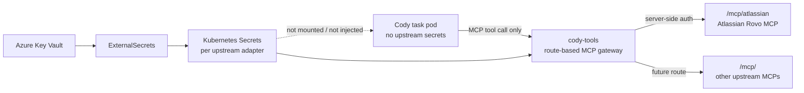
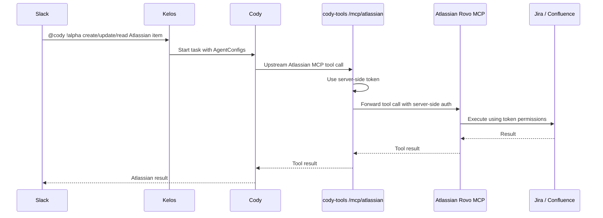
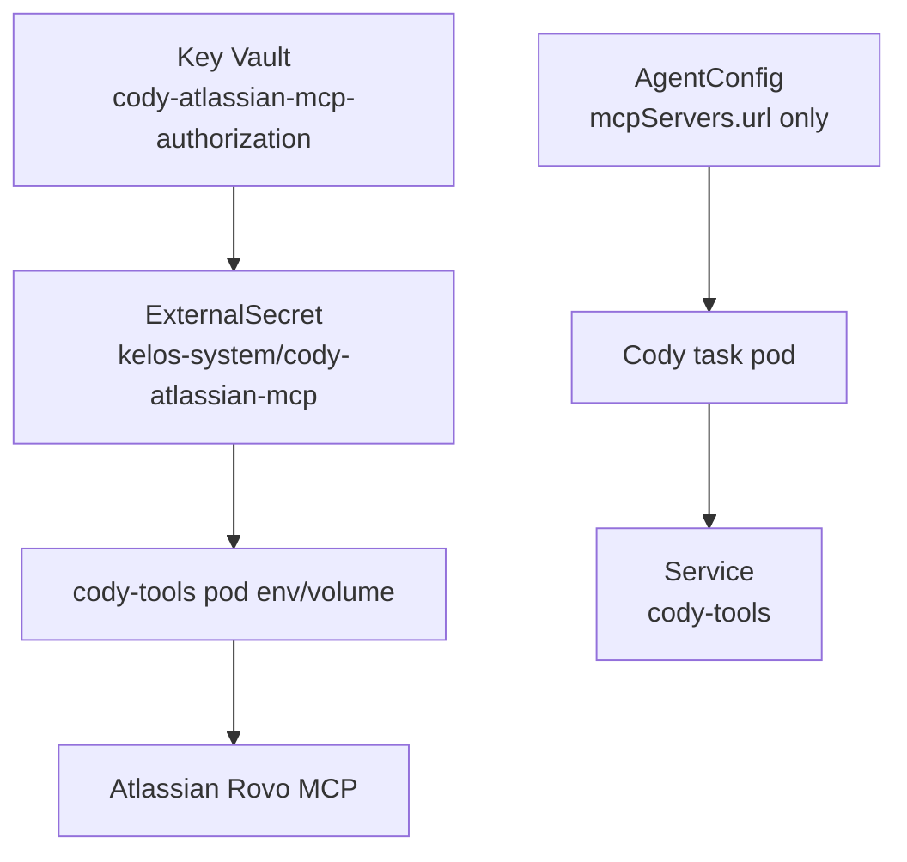

# Cody Tools MCP Gateway: Atlassian Adapter Implementation Spec

## Status

Draft, created 2026-05-20.

This spec covers the first `cody-tools` MCP gateway adapter: Atlassian
Jira/Confluence access for Cody. The `!alpha` ticket-creation test proved that
Cody can bypass MCP by reading MCP credentials from its own runtime and calling
Jira REST directly.

## Problem

Cody currently receives Atlassian credentials in the task runtime through
Kelos MCP configuration. That successfully wires authentication, but it
does not enforce tool usage.

In the observed `!alpha` test, Cody:

- saw `atlassian-rovo` MCP configuration;
- decided the exposed Atlassian MCP surface did not include issue creation;
- read the MCP Authorization header from runtime environment/config;
- called `https://wgen4.atlassian.net/rest/api/3/...` directly with `curl`;
- created `ALPM-27031` successfully;
- printed credential-bearing environment content into task logs while
  debugging.

That means the current design gives Cody a credential, not a capability.
Once the agent has the credential, instructions can encourage MCP usage,
but cannot enforce it.

## External Constraints

- Atlassian Rovo MCP supports API-token authentication for non-interactive
  machine scenarios, but Atlassian documents that API-token auth can expose
  a smaller tool set than OAuth.
- Atlassian also documents that API tokens are not bounded to one cloud ID,
  so clients must explicitly choose the correct site.
- Jira issue creation requires Browse Project and Create Issues
  permissions, and the create payload fields must match the project's
  create metadata.

References:

- Atlassian Rovo MCP API-token auth:
  <https://support.atlassian.com/atlassian-rovo-mcp-server/docs/configuring-authentication-via-api-token/>
- Atlassian Rovo MCP auth model:
  <https://support.atlassian.com/atlassian-rovo-mcp-server/docs/authentication-and-authorization/>
- Jira Cloud create issue API:
  <https://developer.atlassian.com/cloud/jira/platform/rest/v3/api-group-issues/#api-rest-api-3-issue-post>

## Assay Reference Model

Assay solved the same class of problem by constraining the model's execution
surface, not just by writing stronger instructions.

Observed Assay implementation:

- `assay/src/adapters/llm/claude-cli.ts` starts Claude with broad built-in tools
  disallowed, including `Bash`, `Read`, `Write`, `Edit`, `WebFetch`, and
  `WebSearch`, then auto-allows only `mcp__assay__*`.
- `assay/src/agent/mcp-serve.ts` starts a thin MCP subprocess. Tools are
  registered by plugins only; there is no alternate tool set when plugin loading
  fails.
- `assay/src/plugins/loader.ts` loads enabled plugins from the `plugin_config`
  table, resolves env references, decrypts secret fields, validates config, and
  only then registers plugin capabilities.
- `assay/src/core/capability-registry.ts` is default-deny for HTTP and RPC. The
  generic `http_request` tool checks that registry before doing any network
  call.
- The Assay Jira plugin uses server-side Jira REST with Basic auth, defaults to
  `https://wgen4.atlassian.net`, and exposes a controlled `query_jira` MCP tool
  for reads. Jira writes are handled by a reporter path that adds comments.
- Tool calls are wrapped with structured logging, compact argument summaries,
  status, duration, and budget metadata.

Important difference from Cody today:

Assay can pass some secrets to its MCP subprocess because the Claude run cannot
use shell/file tools to inspect the environment. Cody/Codex currently has shell
access in the task pod. Therefore a Cody task must not receive Atlassian
credentials at all.

What Cody should copy:

- Treat MCP tools as the enforced capability boundary.
- Keep Atlassian credentials inside server-side tool code, not in the agent task
  runtime.
- Prefer identity/token permissions over Cody-specific project rules.
- Keep the exposed tool surface as close as possible to the upstream Atlassian
  MCP surface.
- Add redacted structured logs for every MCP tool call.
- If Codex/Kelos later supports tool restrictions equivalent to Assay's
  `--disallowedTools` and `--allowedTools`, run strict Cody routes with only the
  required MCP tool namespace exposed.

What Cody should not copy blindly:

- Do not forward Jira credentials to the task-owned runtime while shell access
  remains available.
- Do not copy Assay's narrow Jira plugin surface. Cody should use the upstream
  Atlassian MCP surface, with access governed by the token.
- Do not make ticket creation a Cody-specific prompt convention.

## Design Goal

Cody should have access to the Atlassian Rovo MCP tool surface permitted by the
Cody Atlassian token, not raw Atlassian credentials.

`cody-tools` should be a generic internal MCP gateway that can host multiple
upstream MCP adapters over time. Atlassian is the first adapter, not the whole
product.

The intended security boundary is:



## Goals

- Cody never receives raw Atlassian credentials.
- Cody can use Atlassian MCP tools exposed by the configured token.
- The Cody Atlassian token has access to `https://wgen4.atlassian.net` only.
- Jira project, issue type, Confluence space, and other product-level access are
  governed by the token's Atlassian permissions, not by Cody-specific rules.
- `cody-tools` can host additional upstream MCP adapters later without changing
  the Cody task secret model.
- Every upstream MCP tool call is relayed, structured, and logged without
  leaking credentials.
- Task logs never contain Atlassian Authorization headers, API tokens,
  OpenAI auth JSON, signing keys, or raw `KELOS_MCP_SERVERS` content.
- The MVP works for `!alpha` first, then can be composed into stable Cody.

## Non-Goals

- Restricting Cody to `ALPM`.
- Restricting Cody to Jira Story creation.
- Rewriting or wrapping Atlassian MCP tools into Cody-specific tool names.
- Reimplementing Atlassian Jira or Confluence tool semantics.
- Building every future `cody-tools` adapter in the first iteration.
- Solving every Rovo MCP limitation.
- Replacing human review for PRs or tickets.
- Moving Cody to production.

## Recommended Architecture

Build an internal MCP gateway named `cody-tools`.

From Cody's perspective, each `cody-tools` route is an MCP server. Internally,
the Atlassian route forwards to Atlassian Rovo MCP with server-side
authentication. The Atlassian route should preserve the upstream Atlassian MCP
surface as closely as possible. Cody sees Atlassian MCP tools, not the
Atlassian credential.

Use one route per upstream MCP adapter:

| Route | Upstream | Status |
| --- | --- | --- |
| `/mcp/atlassian` | Atlassian Rovo MCP | MVP |
| `/mcp/<integration>` | Future upstream MCP | Later |

Route-per-upstream keeps tool names close to the original MCP server and avoids
tool-name collisions across future integrations. Do not merge unrelated MCPs
into one aggregated endpoint for the MVP.

The Atlassian adapter should not define an Alpheya-only Jira surface. Its job is:

- keep Atlassian auth out of Cody task pods;
- use a Cody Atlassian identity whose token only has access to
  `wgen4.atlassian.net`;
- verify at startup that the token cannot see any other Atlassian site;
- expose the upstream Atlassian MCP tools available to the token;
- pass through project, issue type, and Confluence-space behavior to
  Atlassian's own permissions and validation.



## Component Placement

### Code Home

Keep the service in the Kelos fork for now and call it `cody-tools`.

This keeps Cody-specific platform tooling close to the Cody runtime while the
surface is still changing. If the tool surface grows beyond Cody-specific
integrations, it can later move to a standalone Alpheya-owned repo without
changing the external MCP contract exposed to Cody.

Implement `cody-tools` as a small gateway with an adapter boundary. The
Atlassian adapter is the only required adapter in this spec. Future adapters
should get their own route, secret, startup validation, and log labels.

### GitOps Home

Deployment wiring belongs in:

- `k8s-platform-gitops/non-prod/kelos`

The Cody AgentConfig and TaskSpawner are already there, and the gateway is a
platform-side integration for Cody.

## MCP Tool Surface

Do not define an Alpheya-only Jira surface for the Atlassian adapter.

The target surface is the upstream Atlassian Rovo MCP tool set that the token
can access. This includes Jira read, write, and search tools, Confluence tools,
Rovo search/fetch tools, and other Atlassian MCP tools that are available for
the configured auth method and token scopes.

### Token Access Contract

The Atlassian adapter must rely on one access invariant:

- the configured Cody Atlassian token can access only
  `https://wgen4.atlassian.net`.

Preferred identity model:

- Use a dedicated Cody Atlassian identity or service account.
- Grant that identity access to `wgen4.atlassian.net` only.
- Do not add that identity to `alpheya.atlassian.net` or any other Atlassian
  site.
- Let project, issue type, Confluence, and app permissions be controlled inside
  the `wgen4` site through normal Atlassian permissions.

Atlassian itself is the site restriction. `cody-tools` still matters because it
keeps the token out of Cody's task pod and gives us redacted logs.

Implementation contract:

- On startup, call the upstream accessible-resources path.
- If the configured identity can see any Atlassian site other than
  `wgen4.atlassian.net`, fail closed and expose no tools.
- If the configured identity cannot see `wgen4.atlassian.net`, fail closed and
  expose no tools.
- Do not rewrite upstream tool names.
- Do not rewrite upstream tool schemas except where required to relay MCP
  protocol metadata.
- Do not inject or rewrite `cloudId`, project keys, issue types, spaces, or JQL.
- Do not add project-key or issue-type restrictions.
- Preserve upstream Atlassian MCP validation and error messages while redacting
  credentials and unnecessary metadata from logs.

This gives Cody broad Atlassian capability from the configured token while
preventing credential exfiltration. Wrong-site access is prevented by the
Atlassian identity itself.

## Secret Model

### Current Anti-Pattern

The current `headersFrom` pattern causes the resolved Authorization header
to appear in Cody's MCP runtime config. The agent can read it and use it
outside MCP.

### Target Pattern

- Keep the Key Vault secret name:
  `cody-atlassian-mcp-authorization`
- Keep the Kubernetes Secret name:
  `cody-atlassian-mcp`
- Mount or inject that secret only into the `cody-tools` Deployment.
- Remove `headersFrom.secretRef.name: cody-atlassian-mcp` from Cody's
  Atlassian AgentConfig.
- Point Cody's MCP config at the internal gateway service with no Atlassian
  auth header.
- Treat secrets as adapter-scoped. Future upstream MCP adapters get separate
  Key Vault secrets and Kubernetes Secrets; no shared catch-all credential.



## GitOps Changes

Add to `k8s-platform-gitops/non-prod/kelos`:

- `deployment-cody-tools.yaml`
- `service-cody-tools.yaml`
- optional `networkpolicy-cody-tools.yaml`
- existing `external-secret-cody-atlassian-mcp.yaml` reused for the Atlassian
  adapter
- update `agentconfig-cody-atlassian-mcp.yaml`
- update `taskspawner-cody-debug-alpha.yaml` wording if needed

AgentConfig target shape:

```yaml
apiVersion: kelos.dev/v1alpha1
kind: AgentConfig
metadata:
  name: cody-atlassian-mcp
  namespace: kelos-system
spec:
  agentsMD: |
    ## Atlassian MCP

    Use only the Cody Atlassian MCP tools for Jira and Confluence.
    Do not call Jira REST directly. Do not inspect environment variables
    or MCP config for credentials. If a needed MCP tool is unavailable,
    report that as a tool gap.

    Atlassian access is governed by the Cody Atlassian token. The token must
    only have access to `https://wgen4.atlassian.net`.
  mcpServers:
    - name: cody-atlassian
      type: http
      url: http://cody-tools.kelos-system.svc.cluster.local:8080/mcp/atlassian
```

## Kelos Runtime Hardening

This is separate from the gateway but should be done in the same program of
work because the log exposure showed a real safety gap.

In `codex/kelos_entrypoint.sh`:

- After writing MCP config to `~/.codex/config.toml`, unset
  `KELOS_MCP_SERVERS`.
- After writing Codex auth, unset any raw auth JSON environment variable.
- Avoid printing setup/debug data that includes `AUTH`, `TOKEN`, `SECRET`,
  `KEY`, `MCP`, or `CREDENTIAL`.

This does not replace the gateway security boundary, but it reduces accidental
exposure from future integrations.

Assay-style strict tool mode is the stronger long-term control. If Kelos/Codex
supports it, alpha Cody should be runnable with broad shell, file, and web tools
disabled and only Cody-owned MCP tools allowed. Until that exists, the hard
requirement is that no third-party credentials are present in the Cody task
runtime.

## Network Controls

### MVP

- `cody-tools` is `ClusterIP` only.
- Cody AgentConfig points to the internal service DNS name.
- Atlassian credentials are absent from Cody task pods.

### Better Enforcement

Add NetworkPolicy if the cluster CNI enforces it:

- allow Cody task pods to call `cody-tools`;
- allow the Atlassian adapter to call Atlassian Cloud;
- deny Cody task pods direct egress to Atlassian Cloud where practical.

If IP-based Atlassian egress control is brittle, do not block the MVP on it.
The critical enforcement is removing credentials from Cody.

## Logging And Audit

Gateway logs should include:

- adapter / route name;
- tool name;
- Jira issue key or Confluence page ID when present;
- task name if passed by Cody;
- Slack thread URL hash or redacted reference;
- status code category;
- latency.

Gateway logs must not include:

- Authorization headers;
- raw API tokens;
- full request bodies with secret-like strings;
- full Jira user objects unless needed for an explicit tool response.

Every mutating tool should emit a compact audit line using the upstream tool
name:

```text
tool=createJiraIssue issue=<key> caller_task=cody-debug-alpha-slack-slack-... status=success
```

## Testing Plan

### Local Unit Tests

- `/mcp/atlassian` exposes the Atlassian adapter.
- Unknown MCP routes return a clear not-found response and expose no tools.
- Startup validation succeeds when accessible Atlassian resources contain only
  `wgen4.atlassian.net`.
- Startup validation fails closed when accessible Atlassian resources contain
  any non-`wgen4` site.
- Startup validation fails closed when `wgen4.atlassian.net` is absent.
- Upstream Atlassian MCP tool names and schemas are relayed without
  Cody-specific rewrites.
- Route labels appear in every tool invocation log.
- Upstream Jira and Confluence errors are preserved without leaking
  Authorization headers.
- Logs redact Authorization-like strings.

### Integration Tests

- Run `cody-tools` locally against a test token that can only access
  `wgen4.atlassian.net`.
- Confirm MCP tool discovery on `/mcp/atlassian` matches the upstream
  Atlassian MCP tool surface available to that token.
- Confirm startup fails when a test token can also see another Atlassian site.
- Confirm Jira issue creation works through the upstream Atlassian MCP tool in
  any project the token can access.
- Confirm Confluence read/write tools work where the token has permissions.

### GitOps Validation

- `kubectl kustomize non-prod/kelos`
- `kubectl apply --dry-run=server -k non-prod/kelos` where permissions allow.
- Confirm live AgentConfig has internal gateway URL and no `headersFrom`.
- Confirm live Cody task pod has no Atlassian Authorization header in env.

### End-To-End Acceptance

Run:

```text
@cody !alpha create a test story ticket with a placeholder title
```

Pass criteria:

- Slack reply contains a Jira issue link in a project the token can access.
- Cody task logs contain an MCP tool call to `cody-atlassian`.
- `cody-atlassian` points to the `cody-tools` `/mcp/atlassian` route.
- Cody task logs do not show shell commands reading MCP config, environment
  variables, or Authorization headers.
- Cody task logs do not contain `KELOS_MCP_SERVERS`.
- Cody task logs do not contain `Authorization`, API tokens, OpenAI auth
  JSON, or signing keys.
- The created Jira ticket lives under `https://wgen4.atlassian.net`.
- No direct `curl https://wgen4.atlassian.net/rest/api/3/...` appears in Cody
  logs.

## Rollout Plan

### Phase 1: Gateway MVP

- Build `cody-tools` as a route-based MCP gateway.
- Implement `/mcp/atlassian` as a transparent Atlassian MCP relay.
- Add startup validation that the configured token can access only
  `wgen4.atlassian.net`.
- Deploy it in `kelos-system`.
- Repoint alpha AgentConfig from Atlassian Rovo MCP to the internal gateway.
- Keep stable Cody unchanged.

### Phase 2: Secret Removal From Cody

- Remove Atlassian `headersFrom` from Cody AgentConfig.
- Ensure `KELOS_MCP_SERVERS` for alpha contains no Authorization header.
- Add Kelos entrypoint hardening to unset secret-bearing bootstrap env vars.

### Phase 3: E2E Verification

- Create one test Jira issue through `!alpha` using the upstream Atlassian MCP
  create tool.
- Verify logs show MCP tool usage and no secret-bearing env output.
- Rotate any previously exposed personal token.

### Phase 4: Promote Beyond Alpha

- Add the internal MCP gateway AgentConfig to stable Cody.
- Remove direct Rovo MCP usage from Cody task pods.

## Open Decisions

- Auth from Cody to gateway: no-auth ClusterIP with NetworkPolicy for MVP, or
  a future Kelos-supported service-account-token header.
- How exactly to implement transparent MCP relay mechanics for upstream tool
  discovery and tool-call forwarding.
- Whether future upstream MCPs should always use route-per-upstream, or whether
  an explicitly namespaced aggregate endpoint is useful later.
- Whether to require an explicit Slack confirmation before creating a ticket
  for ambiguous requests.

## Recommendation

Implement the gateway first, not more prompt instructions.

Prompt instructions are still useful, but they are not a security boundary.
The right boundary is:

- Cody receives no Atlassian credentials.
- Cody sees a transparent Atlassian MCP surface through `/mcp/atlassian`.
- The Cody Atlassian token owns site, project, issue type, Confluence-space,
  and product-level permissions.
- The `cody-tools` gateway owns upstream auth handling, adapter startup
  validation, and audit logging.
