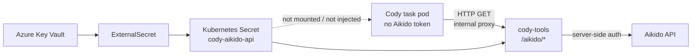
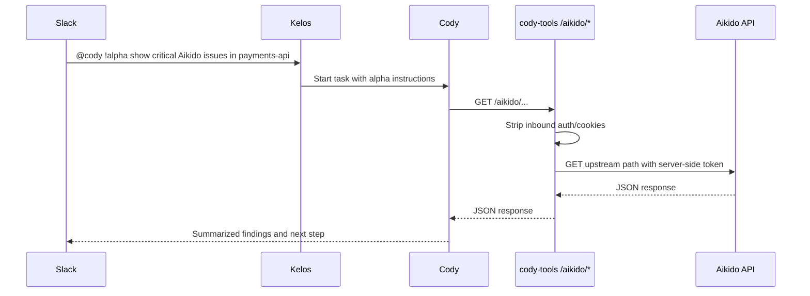

# Cody Tools: Aikido API Proxy Phase 1 Spec

## Status

Draft, created 2026-05-21.

This spec replaces the earlier Aikido MCP-subprocess idea for the first
iteration. Phase 1 is a simple read-only HTTP proxy from Cody to the Aikido API
through `cody-tools`.

## Problem

Cody needs access to Aikido security context during ops/debugging and code
investigation:

- open critical issues by repo or service;
- leaked secrets by repo;
- open source vulnerabilities by repo/service/container;
- SAST and IaC findings;
- cloud, VM, container, malware, EOL software, and surface monitoring issues.

Aikido has public API coverage for these kinds of findings. Aikido also has a
public MCP server, but its documented setup is a local stdio process using
`npx -y @aikidosec/mcp` and `AIKIDO_API_KEY`.

For Cody, the immediate goal is not to run local Aikido scan tools. The
immediate goal is to let Cody read Aikido's existing findings without leaking
the Aikido credential into Cody task pods.

This is the same class of credential-boundary problem we solved for Atlassian:
Cody should receive a capability, not a raw upstream secret.

## Public References

Reviewed 2026-05-21:

- Aikido API docs:
  <https://apidocs.aikido.dev/>
- Aikido open issue groups API:
  <https://apidocs.aikido.dev/reference/listopenissuegroups>
- Aikido export issues API:
  <https://apidocs.aikido.dev/reference/exportissues>
- Aikido issue detail API:
  <https://apidocs.aikido.dev/reference/getissuedetails>
- Aikido MCP overview:
  <https://help.aikido.dev/ai-and-dev-tools/aikido-mcp>
- Aikido OpenAI Codex CLI MCP setup:
  <https://help.aikido.dev/ai-and-dev-tools/aikido-mcp/openai-codex-cli-mcp>
- Aikido MCP troubleshooting:
  <https://help.aikido.dev/ai-and-dev-tools/aikido-mcp/mcp-troubleshooting>

Important public-doc facts:

- Aikido's API exposes issue/finding retrieval workflows that are better suited
  to Cody's investigation use case than local code scanning.
- Aikido's MCP docs describe a local stdio server that uses `AIKIDO_API_KEY`.
- The MCP path may still be useful later for "scan current changes", but it is
  not required for Phase 1.

## Design Goal

Expose Aikido's read-only API through `cody-tools` so Cody can query findings
without receiving Aikido credentials.



## Goals

- Cody can read Aikido issue/finding data through an internal proxy.
- Cody never receives `AIKIDO_API_KEY` or any Aikido auth header.
- Phase 1 supports read-only Aikido API access.
- `cody-tools` injects Aikido auth server-side.
- `cody-tools` strips inbound auth/cookie headers.
- `cody-tools` only forwards to the configured Aikido API host.
- Logs show method, path, status, duration, and adapter name without logging
  credentials or response bodies.
- Enable the instructions on `cody-debug-alpha` first.

## Non-Goals

- Running the official Aikido MCP server.
- Adding Node.js/npm to the `cody-tools` image.
- Downloading or pinning `@aikidosec/mcp`.
- Creating custom MCP tools for Aikido workflows.
- Supporting write operations like ignore, snooze, update, mark false positive,
  or change status.
- Passing a generic Aikido token into Cody.
- Replacing future MCP or typed-tool work.

## Recommended Architecture

Phase 1 should be a simple HTTP API proxy:

| Route | Upstream | Allowed methods | Status |
| --- | --- | --- | --- |
| `/mcp/atlassian` | Atlassian Rovo MCP | MCP HTTP | Existing |
| `/aikido/*` | Aikido API | `GET` only | Phase 1 |

This is intentionally not an MCP server yet. Cody will call the internal proxy
with `curl` or another HTTP client when it needs Aikido context.



## Proxy Contract

Recommended internal base URL:

```text
http://cody-tools.kelos-system.svc.cluster.local:8080/aikido
```

The proxy should map:

```text
GET /aikido/<path>?<query>
```

to:

```text
GET <AIKIDO_API_BASE_URL>/<path>?<query>
```

The exact upstream base URL should be configurable, for example:

```text
CODY_TOOLS_AIKIDO_API_BASE_URL=https://app.aikido.dev/api/public/v1
```

The implementation should preserve query strings exactly, because Aikido issue
APIs may rely on filters/pagination/query parameters.

## Security Rules

### Required

- Only allow `GET` in Phase 1.
- Reject all non-GET methods with `405 Method Not Allowed`.
- Strip inbound `Authorization`.
- Strip inbound `Cookie`.
- Strip hop-by-hop headers.
- Inject server-side Aikido auth from `cody-tools`.
- Do not log request headers.
- Do not log response bodies.
- Reject upstream redirects to any non-Aikido host.
- Do not expose proxy routes outside the cluster.

### Credential Placement

Only `cody-tools` receives the Aikido token.

Cody task pods must not receive:

- `AIKIDO_API_KEY`
- `CODY_TOOLS_AIKIDO_AUTHORIZATION`
- a mounted Aikido secret;
- Aikido API credentials in `KELOS_MCP_SERVERS`;
- any MCP stdio config that includes Aikido credentials.

## Secret Model

Key Vault should contain the raw Aikido API token:

```text
cody-aikido-api-key = "<Aikido API token>"
```

ExternalSecrets should project that into:

```text
Secret: kelos-system/cody-aikido-api
Key:    AIKIDO_API_KEY
```

`cody-tools` then converts that into the upstream auth format required by
Aikido. Phase 1 treats `AIKIDO_API_KEY` as a bearer token unless the value
already includes an auth scheme. `CODY_TOOLS_AIKIDO_AUTHORIZATION` may be used
as an exact full Authorization header when needed. The implementation should
keep the auth-format decision inside `cody-tools`, not in Cody instructions.

## Cody Instructions

Add an alpha-only AgentConfig or alpha-only AGENTS.md section:

```markdown
## Aikido

Use the internal Aikido proxy for Aikido security context:

`http://cody-tools.kelos-system.svc.cluster.local:8080/aikido`

- Use it only for read-only Aikido lookups.
- Do not call Aikido's public API host directly.
- Do not inspect environment variables or MCP config looking for Aikido
  credentials.
- Start from Aikido's issue/finding APIs when asked about vulnerabilities,
  leaked secrets, SAST, IaC, open source vulnerabilities, cloud issues,
  container issues, malware, EOL software, or surface monitoring.
- Summarize findings in Slack. Include severity, affected repo/service/asset,
  issue identifier, and concrete next step when present.
- Do not paste large raw JSON responses unless the user explicitly asks.
```

Phase 1 does not require adding an Aikido `mcpServers` entry because the proxy
is HTTP API access, not an MCP server.

## GitOps Wiring

Expected files in `k8s-platform-gitops/non-prod/kelos`:

- `external-secret-cody-aikido-api.yaml`
- `deployment-cody-tools.yaml`
- `kustomization.yaml`
- alpha AgentConfig/TaskSpawner update for instructions only

`deployment-cody-tools.yaml` should receive:

```yaml
- name: CODY_TOOLS_AIKIDO_API_BASE_URL
  value: https://app.aikido.dev/api/public/v1
- name: AIKIDO_API_KEY
  valueFrom:
    secretKeyRef:
      name: cody-aikido-api
      key: AIKIDO_API_KEY
```

Do not add the Aikido secret to Cody TaskSpawner pod overrides.

## Logging

Good log fields:

- `adapter=aikido`
- `route=/aikido`
- `method=GET`
- `path=/...`
- `status=200`
- `duration_ms=...`
- `error=<redacted summary>`

Do not log:

- `AIKIDO_API_KEY`
- upstream Authorization header;
- inbound headers;
- response bodies;
- raw issue descriptions if they arrive in the response.

## Runtime Usage Guidance

Alpha Cody should use the proxy when:

- the user explicitly asks for Aikido;
- the user asks for known security issues in a repo/service;
- the user asks for leaked secrets, SAST, IaC, or open source vulnerabilities;
- the user asks about cloud, VM, container, malware, EOL software, or surface
  monitoring issues in Aikido;
- Cody wants security context before proposing or opening a fix PR.

Alpha Cody should not use the proxy for every generic ops debug request.

## Acceptance Criteria

### Code

- `cmd/cody-tools` exposes `/aikido/` or `/aikido/*`.
- `/mcp/atlassian` behavior remains unchanged.
- Non-GET requests to `/aikido/*` return `405`.
- The proxy strips inbound auth and cookies.
- The proxy injects server-side Aikido auth.
- The proxy forwards path and query to the configured Aikido API base URL.
- The proxy refuses to forward to non-Aikido hosts.
- Unit tests cover method filtering, auth stripping, query preservation,
  upstream auth injection, and missing-token failure.
- `go test ./cmd/cody-tools` passes.

### GitOps

- `kubectl kustomize non-prod/kelos` succeeds.
- `ExternalSecret/kelos-system/cody-aikido-api` is applied.
- `Deployment/kelos-system/cody-tools` receives `AIKIDO_API_KEY`.
- Alpha Cody instructions mention the internal Aikido proxy.
- Stable Cody is unchanged until alpha validation passes.

### Runtime

- `kubectl -n kelos-system logs deploy/cody-tools` shows Aikido proxy requests
  without token values or response bodies.
- A Slack `!alpha` request can retrieve Aikido findings through the proxy.
- Cody does not call the public Aikido API host directly.
- Cody does not inspect env vars or secrets for Aikido credentials.

## Rollout Plan

1. Implement read-only `/aikido/*` proxy in `cmd/cody-tools`.
2. Build and push `docker.io/alpheya/cody-tools:main`.
3. Add Key Vault secret `cody-aikido-api-key`.
4. Merge gitops wiring for the `cody-tools` secret/env and alpha instructions.
5. Confirm Flux applies the ExternalSecret and Deployment.
6. Restart `deployment/cody-tools` if needed.
7. Run Slack alpha validation:

```text
@cody !alpha show critical Aikido issues for <repo-or-service>
```

8. Check Cody task logs and `cody-tools` logs for proxy usage.
9. Promote the instructions to stable Cody once alpha is reliable.

## Later Work

- Replace raw proxy usage with typed MCP tools for common Aikido workflows.
- Add the official Aikido MCP server for "scan current changes" if needed.
- Add write operations only after explicit product/security review.
- Add response shaping/pagination helpers if raw Aikido responses are too large
  for Cody to handle ergonomically.
- Add per-route audit metrics and OpenTelemetry spans.

## Open Questions

- What is the exact Aikido API base URL for our tenant and token?
- What upstream auth header format does Aikido require for API tokens?
- Which Aikido endpoints should Cody start with in its examples:
  open issue groups, issue details, issue export, or a repo inventory endpoint?
- Should `cody-tools` enforce a small path allowlist in Phase 1, or is GET-only
  plus host restriction enough for alpha?
- Should alpha instructions include a few concrete Aikido endpoint examples once
  we verify the real API paths against the token?
