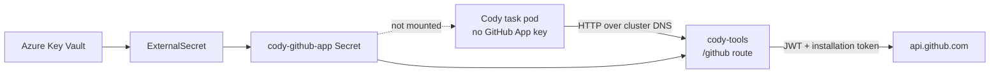

# Cody GitHub Token Broker in `cody-tools`

Date: 2026-05-25

Status: implementation spec

Worktree: `cody/github-tools-docker-runtime-spec`

Latest baselines inspected:

- Kelos `origin/main`: `fd6ad457104737997ac0ea42d79234ea5e7d983e`
- k8s-platform-gitops `origin/main`: `94ae9202d19c3881ea0961be94c4b96bbcf7a7c2`

## Problem

Cody task pods currently receive the GitHub App client ID, installation ID, and
private key. The pod signs GitHub App JWTs locally and exchanges them for
installation tokens. That is useful, but it puts the long-lived App private key
inside the same shell-visible runtime that the agent can inspect.

This should move to `cody-tools`, matching the existing pattern for Atlassian
and Aikido: Cody receives a tool endpoint; upstream credentials stay in the
server-side tool process.

## Goals

- Cody task pods must not receive `GITHUB_APP_PRIVATE_KEY`.
- `cody-tools` should mint short-lived GitHub App installation tokens.
- Cody should keep working with `git` credential helpers and `gh` CLI.
- Git credential behavior should match today's GitHub.com-only helper.
- Repository and permission downscoping should be treated as optional future
  hardening, not required for parity.
- k8s-platform should mount the GitHub App Secret into `cody-tools`, not into
  each TaskSpawner.
- The deployment should cut over in one coordinated change with no task-local
  GitHub App fallback.

## Non-Goals

- Do not build a general GitHub MCP server in this change.
- Do not solve GitHub Packages npm authentication here; package installs have
  separate behavior and a separate spec.
- Do not broaden the GitHub App installation permissions.
- Do not introduce repository or permission downscoping in the MVP unless a
  concrete Cody workflow requires it.
- Do not remove `Workspace.spec.secretRef` yet; that static-token path can stay
  for non-Cody use while Cody migrates.

## Current Kelos Findings

- `cmd/cody-tools/main.go` already serves an internal gateway on `:8080` with:
  - `/mcp/atlassian`
  - `/aikido`
  - `/mcp/context`
- `cody-tools` config is env-driven and startup validation currently requires
  Atlassian credentials.
- `codex/scripts/kelos-agent-setup` writes `GITHUB_APP_PRIVATE_KEY` to
  `$HOME/.kelos-agent/github-app.pem` and configures
  `/usr/local/bin/github-app-credential-helper`.
- `codex/scripts/github-app-token` signs the JWT in the task pod and calls:
  `POST https://api.github.com/app/installations/{id}/access_tokens`.
- The current token request sends no `repositories`, `repository_ids`, or
  `permissions` body. GitHub therefore returns an installation token bounded by
  the App installation's existing repository selection and permission grants.
- `codex/scripts/gh` sets `GH_TOKEN` by calling the local
  `github-app-token` helper.
- `internal/controller/job_builder.go` separately supports
  `Workspace.spec.secretRef`, which injects static `GITHUB_TOKEN` / `GH_TOKEN`
  into the pod when configured.

## Current k8s-platform Findings

- `non-prod/kelos/external-secret-cody-github-app.yaml` creates
  `cody-github-app` with:
  - `GITHUB_APP_CLIENT_ID`
  - `GITHUB_APP_INSTALLATION_ID`
  - `GITHUB_APP_PRIVATE_KEY`
- `non-prod/kelos/deployment-cody-tools.yaml` mounts Atlassian and Aikido
  secrets, but not GitHub secrets.
- Cody TaskSpawners inject `GITHUB_APP_*` directly, including:
  - `taskspawner-cody-debug.yaml`
  - `taskspawner-cody-dev.yaml`
  - `taskspawner-cody-ticket.yaml`
  - `taskspawner-cody-pr-reviewer-slack.yaml`
  - `taskspawner-cody-debug-alpha.yaml`
  - `taskspawner-cody-session.yaml`
- `networkpolicy-cody-tools.yaml` already allows ingress to `cody-tools` only
  from pods labeled `cody.alpheya.com/tools-client: "true"`.

## Public Documentation Constraints

- GitHub App installation tokens are generated by sending an App JWT to
  `POST /app/installations/{installation_id}/access_tokens`.
- GitHub documents optional repository and permission downscoping for
  installation tokens. Current Cody does not use that optional body; if omitted,
  the token receives all repositories and permissions granted to the
  installation.
- Installation tokens expire after one hour.
- GitHub documents that HTTP Git access with an installation token requires
  repository `Contents` permission, and the installation token is used as the
  HTTP password.
- GitHub CLI reads `GH_TOKEN` / `GITHUB_TOKEN` for `github.com`, in that
  precedence order.

References:

- <https://docs.github.com/en/apps/creating-github-apps/authenticating-with-a-github-app/generating-an-installation-access-token-for-a-github-app>
- <https://docs.github.com/en/apps/creating-github-apps/registering-a-github-app/choosing-permissions-for-a-github-app#choosing-permissions-for-git-access>
- <https://cli.github.com/manual/gh_help_environment>

## Recommended Architecture



## `cody-tools` API

Add a GitHub adapter route:

- Route prefix: `/github`
- Default service URL:
  `http://cody-tools.kelos-system.svc.cluster.local:8080/github`

### Config

For the MVP, add only the config needed to move today's credential authority
from the task pod into `cody-tools`.

Required server-side config:

- `CODY_TOOLS_GITHUB_APP_CLIENT_ID`
- `CODY_TOOLS_GITHUB_APP_INSTALLATION_ID`
- `CODY_TOOLS_GITHUB_APP_PRIVATE_KEY`

Required task-pod config:

- `CODY_TOOLS_GITHUB_BASE_URL`, for example
  `http://cody-tools.kelos-system.svc.cluster.local:8080/github`

Use the same GitHub.com assumptions the current helper scripts already use:

- exchange App JWTs against `https://api.github.com`;
- return git credentials only for HTTPS requests to `github.com` and
  `api.github.com`.

Do not add these config fields or runtime knobs in the MVP:

- `CODY_TOOLS_GITHUB_DEFAULT_REPOSITORIES`
- `CODY_TOOLS_GITHUB_DEFAULT_PERMISSIONS`
- `CODY_TOOLS_GITHUB_ALLOWED_HOSTS`
- `CODY_TOOLS_GITHUB_API_BASE_URL`
- `CODY_TOOLS_GITHUB_TOKEN_EXPIRY_SKEW`
- token cache controls

Those are new hardening/enterprise knobs, not behavior that exists today. Add
them later only when there is a real need for GitHub Enterprise, per-route
downscoping, or token caching.

GitHub config should be optional. `cody-tools` should still start without it
when the GitHub route is unused, because existing deployments may only need
Atlassian/Aikido/context.

### `POST /github/app/installations/token`

Purpose: mint a GitHub App installation token for command wrappers.

Request:

```json
{
  "purpose": "gh"
}
```

Response:

```json
{
  "token": "redacted",
  "expires_at": "2026-05-25T12:00:00Z",
  "source": "github_app_installation"
}
```

Rules:

- Call GitHub's installation-token endpoint without `repositories`,
  `repository_ids`, or `permissions`, matching today's helper behavior.
- Rely on the GitHub App installation's configured repository selection and
  permissions for authorization.
- Never log token values.
- `purpose` is for structured logging only in the MVP. It must not imply a
  partially-enforced policy.

### `POST /github/credential`

Purpose: support git credential helper calls without exposing App credentials.

Request:

```json
{
  "protocol": "https",
  "host": "github.com",
  "path": "quantum-wealth/order-service.git"
}
```

Response:

```json
{
  "username": "x-access-token",
  "password": "redacted",
  "expires_at": "2026-05-25T12:00:00Z"
}
```

Rules:

- Return no credentials for non-HTTPS requests, matching today's helper.
- Return credentials only for the same hosts as today's helper:
  `github.com` and `api.github.com`.
- Do not try to enforce repository allowlists in the MVP. GitHub's installation
  token remains bounded by the App installation.
- Return an empty credential response for unsupported hosts so git can fall
  through to other helpers.

## Token Minting

Mint one installation token per `cody-tools` request in the MVP.

Rationale:

- This exactly matches today's `github-app-token` helper behavior.
- It avoids adding cache invalidation, skew, and cache-key design before there
  is evidence that token creation volume is a problem.
- GitHub still controls the resulting token lifetime.

Token caching is a future optimization. If added later, cache by installation
ID and token request body, and reuse only until a conservative expiry skew.

Structured logs should include:

- purpose
- expiry timestamp
- upstream status code

Logs must not include:

- installation token
- App private key
- App JWT
- Authorization header

## Agent Image Changes

Keep the existing helper command names to avoid changing callers, but make
them broker clients only:

- `github-app-token`
  - calls `cody-tools /github/app/installations/token`;
  - fails clearly if `CODY_TOOLS_GITHUB_BASE_URL` is unset or unreachable;
  - prints only the token, matching current behavior.
- `github-app-credential-helper`
  - calls `cody-tools /github/credential`;
  - returns no credential for unsupported hosts;
  - fails clearly when the broker is configured but unavailable;
  - emits git credential-helper output.

Add clearer new names:

- `cody-github-token`
- `cody-github-credential-helper`

Update `codex/scripts/kelos-agent-setup`:

- stop writing `GITHUB_APP_PRIVATE_KEY` to disk;
- require `CODY_TOOLS_GITHUB_BASE_URL` for Cody GitHub helper setup;
- configure git credential helper to call the broker-backed helper;
- continue configuring git identity;
- continue writing kubeconfig from the projected service account token.

Update `codex/scripts/gh`:

- if `GH_TOKEN` or `GITHUB_TOKEN` is already set, preserve it;
- otherwise call `cody-github-token --purpose gh`;
- export only `GH_TOKEN` to the child process.

Update the existing `npm` and `pnpm` wrappers only to remove task-local GitHub
App signing:

- if `NODE_AUTH_TOKEN` is already set, preserve it;
- otherwise call `cody-github-token --purpose npm|pnpm`;
- keep package-manager behavior otherwise unchanged. GitHub Packages auth
  design remains covered by the separate private package install auth spec.

Do not keep a task-local `GITHUB_APP_*` fallback path. After cutover, if a Cody
pod needs GitHub auth and cannot reach `cody-tools`, the command should fail
instead of silently signing tokens locally.

## k8s-platform Changes

Update `non-prod/kelos/deployment-cody-tools.yaml`:

```yaml
env:
  - name: CODY_TOOLS_GITHUB_APP_CLIENT_ID
    valueFrom:
      secretKeyRef:
        name: cody-github-app
        key: GITHUB_APP_CLIENT_ID
  - name: CODY_TOOLS_GITHUB_APP_INSTALLATION_ID
    valueFrom:
      secretKeyRef:
        name: cody-github-app
        key: GITHUB_APP_INSTALLATION_ID
  - name: CODY_TOOLS_GITHUB_APP_PRIVATE_KEY
    valueFrom:
      secretKeyRef:
        name: cody-github-app
        key: GITHUB_APP_PRIVATE_KEY
```

Remove these env vars from every Cody TaskSpawner:

- `GITHUB_APP_CLIENT_ID`
- `GITHUB_APP_INSTALLATION_ID`
- `GITHUB_APP_PRIVATE_KEY`

Add:

```yaml
- name: CODY_TOOLS_GITHUB_BASE_URL
  value: http://cody-tools.kelos-system.svc.cluster.local:8080/github
```

Keep:

```yaml
labels:
  cody.alpheya.com/tools-client: "true"
```

Update `external-secret-cody-github-app.yaml` comments:

- this Secret is consumed by `cody-tools`;
- task pods must not reference it directly;
- rollout is complete when no TaskSpawner injects `GITHUB_APP_*`.

## Network Policy

The current ingress policy is sufficient for MVP access control:

- only labeled Cody pods can call `cody-tools`;
- `cody-tools` is not exposed outside the cluster by this spec.

If the cluster supports Cilium FQDN policies or equivalent, add egress for:

- `api.github.com`
- `github.com`

Do not add fake FQDN egress using standard Kubernetes `NetworkPolicy`; it
cannot express DNS names.

## Rollout Plan

1. Implement GitHub route in `cody-tools`.
2. Change Codex image helpers so `github-app-token`,
   `github-app-credential-helper`, and `gh` call `cody-tools` only.
3. Deploy `cody-tools` with GitHub credentials in non-prod.
4. In the same GitOps rollout, remove `GITHUB_APP_*` from Cody TaskSpawners
   and add `CODY_TOOLS_GITHUB_BASE_URL`.
5. Run canaries immediately after rollout:
   - `git ls-remote https://github.com/quantum-wealth/<private-repo>.git`
   - `gh repo view quantum-wealth/<private-repo>`
   - `git push` to a scratch branch, if write permission is expected.
6. Roll back the GitOps image/config pair together if broker auth fails.

## Validation

Kelos tests:

- `go test ./internal/githubapp ./cmd/cody-tools`
- `go test ./internal/controller`

Test cases:

- `cody-tools` starts without GitHub config when GitHub routes are unused.
- GitHub token endpoint ignores client-supplied repository or permission
  downscoping fields in the MVP, or rejects them explicitly. It must not
  introduce a partially-enforced policy.
- Git credential endpoint returns `x-access-token` for allowed GitHub HTTPS
  remotes.
- Git credential endpoint returns no credential for unsupported hosts.
- Token endpoint mints per request, matching today's task-local helper.
- Logs never contain token or private key material.

k8s-platform checks:

- `kubectl kustomize non-prod/kelos` renders.
- `cody-tools` Deployment has `CODY_TOOLS_GITHUB_*`.
- Cody TaskSpawners no longer contain `GITHUB_APP_*`.
- Cody TaskSpawners still carry `cody.alpheya.com/tools-client: "true"`.

## Risks

- `cody-tools` becomes a token broker. Mitigate with NetworkPolicy, the
  existing GitHub.com-only credential behavior, GitHub App installation
  scoping, upstream one-hour token lifetime, and no token logging.
- Existing wrappers may be called in contexts without `cody-tools`. Mitigate
  with clear errors and a coordinated image/config cutover, not local signing
  fallback.
- Future repository downscoping could break fork workflows if designed too
  narrowly. Keep it out of the MVP and revisit only after the parity broker is
  stable.
