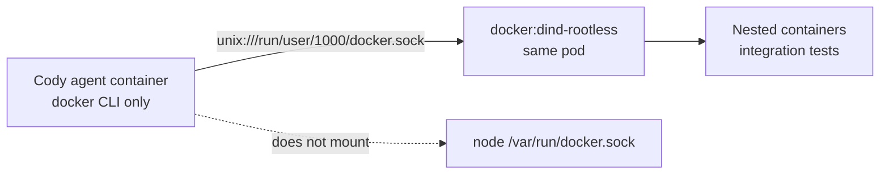

# Cody Per-Runtime Docker

Date: 2026-05-25

Status: implementation spec

Worktree: `cody/github-tools-docker-runtime-spec`

Latest baselines inspected:

- Kelos `origin/main`: `fd6ad457104737997ac0ea42d79234ea5e7d983e`
- k8s-platform-gitops `origin/main`: `94ae9202d19c3881ea0961be94c4b96bbcf7a7c2`

## Problem

Cody runtimes need to run integration tests that depend on Docker, Docker
Compose, or Testcontainers. Current Cody task pods do not get a Docker daemon.
Mounting the node's host Docker socket would solve this technically, but it
would give the task pod control over the node's Docker API and is not an
acceptable isolation boundary.

Each Docker-enabled Cody runtime should instead get its own Docker daemon
inside its own pod.

## Goals

- Add opt-in Docker support per Kelos Task/TaskSpawner.
- Do not mount the host Docker socket.
- Use a pod-local Unix socket shared between the Cody container and the Docker
  daemon container.
- Keep Docker disabled by default.
- Make the security and scheduling requirements explicit in k8s-platform.
- Support integration tests that use Docker CLI, Docker Compose, and
  Testcontainers.

## Non-Goals

- Do not make every Kelos task privileged.
- Do not build a remote shared Docker service.
- Do not solve production-grade build farms or remote cache.
- Do not support Kubernetes-in-Docker in the first implementation.
- Do not enable Docker on ticket/review-only Cody personas unless there is a
  concrete need.

## Current Kelos Findings

- `api/v1alpha1/task_types.go` has `PodOverrides` for env, volumes, security
  contexts, scheduling, resources, image pull secrets, and service account.
- `PodOverrides` cannot add sidecar containers.
- `internal/controller/job_builder.go` creates one main agent container and
  optional init containers for workspace clone, remotes, branch setup, files,
  plugin setup, and skills install.
- `codex/Dockerfile` currently installs many debug tools, but does not install
  Docker CLI or Docker Compose plugin.
- `reservedVolumeNames` currently blocks only `workspace` and `kelos-plugin`.

## Current k8s-platform Findings

- Cody TaskSpawners use `docker.io/alpheya/codex:main` or session-specific
  images.
- There is no Docker-related pod override in `non-prod/kelos`.
- `deployment-cody-tools.yaml` is restricted and should remain unrelated to
  Docker.

## Public Documentation Constraints

- Docker rootless mode runs daemon and containers inside a user namespace.
- Docker's rootless Docker-in-Docker guidance still shows
  `docker:<version>-dind-rootless` running with `--privileged` because the
  outer container must relax seccomp/AppArmor/mount-mask behavior.
- Docker warns that unauthenticated TCP Docker API access gives full Docker API
  control. Use a shared Unix socket, not `tcp://0.0.0.0:2375`.
- Kubernetes Pod Security Admission enforces `privileged`, `baseline`, and
  `restricted` by namespace labels. Privileged sidecars will not pass
  `baseline` or `restricted`.
- Kubernetes supports native sidecars as restartable init containers from
  v1.29 by default. Kelos uses `k8s.io/api v0.35.1`, so the Go API supports
  this field.
- Testcontainers needs a Docker-API-compatible runtime and may need explicit
  environment configuration in non-standard setups.

References:

- <https://docs.docker.com/engine/security/rootless/>
- <https://docs.docker.com/engine/security/rootless/tips/>
- <https://hub.docker.com/_/docker>
- <https://docs.docker.com/reference/cli/dockerd/>
- <https://kubernetes.io/docs/concepts/workloads/pods/sidecar-containers/>
- <https://kubernetes.io/docs/tasks/configure-pod-container/enforce-standards-namespace-labels/>
- <https://docs.docker.com/testcontainers/>

## Recommended Architecture



The agent container has Docker CLI and Compose plugin. The Docker daemon runs
in a separate container in the same pod. The two containers share:

- network namespace, because they are in the same pod;
- a Unix socket volume;
- no host Docker socket.

## API Shape

Add a typed optional field under `PodOverrides`:

```yaml
podOverrides:
  docker:
    enabled: true
    mode: dind-rootless
    image: docker:28.5-dind-rootless
    storage:
      medium: ""
      sizeLimit: 40Gi
    resources:
      requests:
        cpu: "500m"
        memory: 1Gi
      limits:
        cpu: "4"
        memory: 8Gi
```

Proposed Go types:

```go
type DockerRuntimeMode string

const (
  DockerRuntimeModeDindRootless DockerRuntimeMode = "dind-rootless"
  DockerRuntimeModeDind         DockerRuntimeMode = "dind"
)

type DockerRuntime struct {
  Enabled bool `json:"enabled"`
  Mode DockerRuntimeMode `json:"mode,omitempty"`
  Image string `json:"image,omitempty"`
  Storage *corev1.EmptyDirVolumeSource `json:"storage,omitempty"`
  Resources *corev1.ResourceRequirements `json:"resources,omitempty"`
}
```

Add to `PodOverrides`:

```go
Docker *DockerRuntime `json:"docker,omitempty"`
```

Validation:

- `mode` enum: `dind-rootless`, `dind`
- `image` optional but must not default to `latest`
- `storage` optional
- `resources` optional

Defaults:

- `enabled`: false
- `mode`: `dind-rootless`
- `image`: a pinned Docker minor, for example `docker:28.5-dind-rootless`
- `storage`: `emptyDir` with no default size limit unless configured
- `resources`: controller-owned conservative defaults

## Job Builder Behavior

When `podOverrides.docker.enabled=true`, `internal/controller/job_builder.go`
should:

1. Add reserved volumes:
   - `docker-run`
   - `docker-data`
2. Mount `docker-run` into the agent container at `/run/user/1000`.
3. Mount `docker-run` into the Docker daemon container at `/run/user/1000`.
4. Mount `docker-data` into the Docker daemon container's data root.
5. Add env to the agent container:
   - `DOCKER_HOST=unix:///run/user/1000/docker.sock`
   - `TESTCONTAINERS_HOST_OVERRIDE=127.0.0.1`
6. Add env to the Docker daemon container:
   - `DOCKER_TLS_CERTDIR=""`
   - `XDG_RUNTIME_DIR=/run/user/1000`
7. Ensure the agent entrypoint waits for `docker info` before running setup or
   the agent process.

New reserved volume names:

- `docker-run`
- `docker-data`

`validateUserVolumes` must reject user-supplied volumes with these names.

## Sidecar Form

Preferred implementation: restartable init container.

```yaml
initContainers:
  - name: docker
    image: docker:28.5-dind-rootless
    restartPolicy: Always
    env:
      - name: DOCKER_TLS_CERTDIR
        value: ""
      - name: XDG_RUNTIME_DIR
        value: /run/user/1000
    securityContext:
      privileged: true
      runAsUser: 1000
      runAsGroup: 1000
    volumeMounts:
      - name: docker-run
        mountPath: /run/user/1000
      - name: docker-data
        mountPath: /home/rootless/.local/share/docker
```

Why restartable init container:

- It starts before the main agent container.
- It keeps running while the agent runs.
- It does not keep the Job alive after the main container exits.
- It matches Kubernetes sidecar semantics.

Fallback:

- If the cluster is older than Kubernetes 1.29, use a regular sidecar
  container and make the main entrypoint responsible for daemon readiness.
- Avoid this fallback unless needed; regular sidecars in Jobs can make
  completion behavior harder to reason about.

## Security Model

Rootless dind still needs a privileged outer container. That is an important
tradeoff, not an implementation detail.

Rules:

- Docker support is disabled by default.
- Docker support is enabled only through `podOverrides.docker.enabled`.
- Do not mount `/var/run/docker.sock` from the host.
- Do not expose the Docker API over TCP.
- Use a Unix socket in an `emptyDir` volume.
- Use dedicated scheduling for Docker-enabled Cody pods.
- Keep `cody-tools` Deployment restricted and non-privileged.

Suggested Docker sidecar security context:

```yaml
securityContext:
  privileged: true
  runAsUser: 1000
  runAsGroup: 1000
```

Suggested agent container additions:

```yaml
env:
  - name: DOCKER_HOST
    value: unix:///run/user/1000/docker.sock
  - name: TESTCONTAINERS_HOST_OVERRIDE
    value: 127.0.0.1
```

## Agent Image Changes

In `codex/Dockerfile`:

- Install Docker CLI.
- Install Docker Compose plugin.
- Do not install or start Docker daemon in the agent container.
- Keep the CLI usable as the non-root `agent` user.

Update `codex/kelos_entrypoint.sh` or `kelos-agent-setup`:

- If `DOCKER_HOST` is set, wait for `docker info` to pass.
- Use a bounded timeout, for example 60 seconds.
- Fail the task with a clear message if the daemon never becomes ready.
- Run workspace setup only after Docker is ready, because setup commands may
  run integration-test dependencies.

## k8s-platform Rollout

Enable Docker only on Cody routes that need integration tests. Initial
recommended routes:

- `taskspawner-cody-debug.yaml`
- `taskspawner-cody-dev.yaml`
- optionally `taskspawner-cody-debug-alpha.yaml`
- optionally `taskspawner-cody-session.yaml` if sessions are expected to run
  integration tests

Avoid enabling Docker initially for:

- `taskspawner-cody-ticket.yaml`
- `taskspawner-cody-pr-reviewer-slack.yaml`
- `taskspawner-cody-pr-babysitter-slack.yaml`

Add scheduling controls:

```yaml
podOverrides:
  docker:
    enabled: true
    mode: dind-rootless
  nodeSelector:
    alpheya.com/workload: cody-docker
  tolerations:
    - key: alpheya.com/workload
      operator: Equal
      value: cody-docker
      effect: NoSchedule
```

Exact labels/taints should match the node pool that platform chooses.

## Pod Security Requirements

Because Docker sidecar uses `privileged: true`, one of these must be true:

- the `kelos-system` namespace allows privileged pods; or
- Docker-enabled Cody jobs move to a dedicated namespace with the correct Pod
  Security Admission label; or
- an admission exception exists for only this workload class.

Recommended:

- Use a dedicated non-prod node pool.
- Use labels/taints so only Docker-enabled Cody pods schedule there.
- Keep this out of production until the exact security posture is accepted.

## Testcontainers Notes

The agent container and dind sidecar share the pod network namespace. With a
Unix socket Docker API, containers launched by dind publish ports into the pod
network namespace. `TESTCONTAINERS_HOST_OVERRIDE=127.0.0.1` is the expected
starting point.

Canary this explicitly for each language/runtime:

- Node Testcontainers
- Java Testcontainers, if any repo uses it
- Go integration tests that shell out to Docker
- Docker Compose based tests

If a framework discovers the wrong host, make the framework-specific env vars
part of the TaskSpawner pod override rather than baking them globally.

## Validation

Kelos render/unit tests:

- Docker sidecar is absent when `podOverrides.docker` is nil.
- Docker sidecar is absent when `enabled=false`.
- Docker sidecar is present when `enabled=true`.
- `docker-run` and `docker-data` volumes are created.
- agent container gets the socket mount and `DOCKER_HOST`.
- user-supplied volumes named `docker-run` or `docker-data` are rejected.
- resources and image overrides render into the Docker sidecar.

Image tests:

- `docker --version`
- `docker compose version`

Runtime canaries:

```bash
docker info
docker run --rm hello-world
docker compose version
```

Repo canaries:

- run one Node Testcontainers test;
- run one Docker Compose backed integration test;
- run one platform-services integration test that expects Docker, if present.

k8s-platform checks:

- `kubectl kustomize non-prod/kelos` renders.
- Docker-enabled TaskSpawners include the expected `podOverrides.docker`.
- Docker-enabled TaskSpawners include node selector/toleration/resource
  controls.
- non-Docker Cody personas remain unchanged.

## Risks

- Privileged sidecars weaken pod isolation. Mitigate by making Docker opt-in,
  avoiding host socket mounts, and using dedicated scheduling.
- Docker daemon startup can race setup commands. Mitigate with entrypoint
  `docker info` readiness wait.
- Dind storage can fill node ephemeral storage. Mitigate with resource and
  `emptyDir.sizeLimit` controls.
- Testcontainers host detection may vary by language. Mitigate with canaries
  and framework-specific env overrides.
