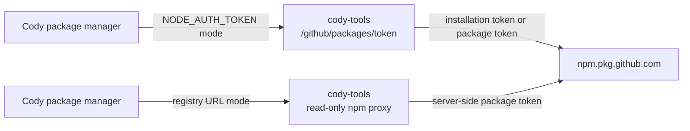

# Cody Private Package Install Auth

Date: 2026-05-25

Status: implementation spec

Worktree: `cody/github-tools-docker-runtime-spec`

Latest baselines inspected:

- Kelos `origin/main`: `fd6ad457104737997ac0ea42d79234ea5e7d983e`
- k8s-platform-gitops `origin/main`: `94ae9202d19c3881ea0961be94c4b96bbcf7a7c2`

## Problem

Cody needs to run package installs inside Alpheya workspaces. Many repos depend
on private `@quantum-wealth/*` packages hosted in GitHub Packages. Today, the
Codex image has `npm` and `pnpm` wrappers that mint a GitHub App installation
token inside the task pod and export it as `NODE_AUTH_TOKEN`.

That approach has two issues:

1. It depends on the same task-pod GitHub App private key that should move to
   `cody-tools`.
2. GitHub's public npm package docs still describe npm registry authentication
   as classic PAT or GitHub Actions `GITHUB_TOKEN`, not arbitrary GitHub App
   installation tokens.

Package-install auth should therefore be its own implementation track, separate
from the GitHub token broker.

## Goals

- Cody should run `npm install`, `npm ci`, `pnpm install`, and Yarn installs in
  representative Alpheya repos with private `@quantum-wealth/*` dependencies.
- Task pods should not receive GitHub App private keys.
- `NODE_AUTH_TOKEN` should be the single package-manager token contract.
- The design must distinguish documented GitHub behavior from behavior we have
  only canary-validated in our org.
- If a long-lived package token is required, prefer keeping it inside
  `cody-tools` behind a read-only registry proxy.

## Non-Goals

- Do not solve git clone/push auth here; that is covered by the GitHub token
  broker spec.
- Do not update every repo `.npmrc` in this Kelos implementation.
- Do not publish or rotate packages.
- Do not build package publishing support through Cody.

## Current Workspace Findings

The workspace has mixed package-manager configuration:

- Many npm/pnpm repos already use:
  ```ini
  @quantum-wealth:registry=https://npm.pkg.github.com
  //npm.pkg.github.com/:_authToken=${NODE_AUTH_TOKEN}
  ```
- Some repos configure the registry only and rely on a human's global
  `~/.npmrc` for auth.
- Some platform-services module `.npmrc` files set `always-auth=true` but do
  not declare an auth token line.
- `alpheya-common-packages/.npmrc` uses `${GITHUB_TOKEN}` instead of
  `${NODE_AUTH_TOKEN}`.
- `investor-adib/.yarnrc.yml` already maps `@quantum-wealth` to
  `npm.pkg.github.com` and reads `${NODE_AUTH_TOKEN-}`.
- `ghaf-sandbox/.yarnrc.yml` currently has no `@quantum-wealth` npm scope.
- One local repo contains a hard-coded `ghp_...` token in `.npmrc`. That token
  should be removed and rotated outside this Kelos change.

## Public Documentation Constraints

- GitHub Packages npm docs document authentication with a classic PAT, or with
  `GITHUB_TOKEN` inside GitHub Actions.
- Cody does not run inside GitHub Actions, so using GitHub Actions
  `GITHUB_TOKEN` is not available.
- GitHub App installation tokens may work for GitHub Packages in practice when
  the App has package permissions, but the npm registry docs do not state that
  as the supported non-Actions auth path.
- npm v11 `.npmrc` supports environment variable interpolation and requires
  auth settings such as `_authToken` to be scoped to a registry URI fragment.
- pnpm reads `.npmrc`; it does not shell out to npm, so an npm wrapper does not
  cover pnpm.
- Yarn Berry reads `.yarnrc.yml`; it also needs the token in the environment
  before install starts.

References:

- <https://docs.github.com/en/packages/working-with-a-github-packages-registry/working-with-the-npm-registry>
- <https://docs.github.com/en/packages/learn-github-packages/about-permissions-for-github-packages>
- <https://docs.npmjs.com/cli/v11/configuring-npm/npmrc>
- <https://pnpm.io/npmrc>
- <https://yarnpkg.com/configuration/yarnrc>

## Recommended Architecture

Package auth has two viable modes. The implementation should support both, but
roll out in this order.



## Mode 1: Token Return

This mode is the lowest-effort migration from current wrappers.

Add to `cody-tools`:

- `POST /github/packages/token`

Response:

```json
{
  "token": "redacted",
  "expires_at": "2026-05-25T12:00:00Z",
  "source": "github_app_installation"
}
```

Allowed `source` values:

- `github_app_installation`
- `github_packages_token`

Rules:

- Prefer `github_app_installation` only after the canary confirms that
  `npm.pkg.github.com` accepts the App installation token for
  `@quantum-wealth/*`.
- If the canary fails, return `github_packages_token` only if
  `CODY_TOOLS_GITHUB_PACKAGES_TOKEN` is configured.
- Do not log the token.
- Include `source` in structured logs so operators know which auth path is in
  use.

Security tradeoff:

- If `source=github_packages_token`, a long-lived package token is exposed as
  `NODE_AUTH_TOKEN` to the task process. This should be treated as an
  intermediate state, not the final security boundary.

## Mode 2: Read-Only npm Registry Proxy

This is the preferred final state if GitHub App installation tokens do not work
against GitHub Packages.

Add to `cody-tools`:

- Route prefix: `/npm/`
- Upstream: `https://npm.pkg.github.com/`
- Methods allowed: `GET`, `HEAD`
- Methods denied: all writes, including `PUT`, `POST`, `PATCH`, `DELETE`

Task package-manager config points the private scope at:

```ini
@quantum-wealth:registry=http://cody-tools.kelos-system.svc.cluster.local:8080/npm/
```

Proxy rules:

- Inject upstream package auth server-side.
- Preserve package metadata and tarball responses.
- Rewrite tarball URLs in package metadata from
  `https://npm.pkg.github.com/download/...` to the proxy route, otherwise
  clients may fetch tarballs directly from GitHub Packages and require
  agent-visible auth.
- Preserve npm cache headers where safe.
- Log package name, version, method, upstream status, and byte count.
- Never log `Authorization`.

This mode keeps the long-lived package token out of the agent runtime and
matches the security boundary used by Atlassian in `cody-tools`.

## Agent Image Changes

Update wrappers in `codex/scripts`:

- `npm`
  - preserve pre-set `NODE_AUTH_TOKEN`;
  - otherwise call `cody-tools /github/packages/token`;
  - export `NODE_AUTH_TOKEN` only for the child process.
- `pnpm`
  - same behavior as npm;
  - required because pnpm reads `.npmrc` directly.
- `yarn` or Corepack shim
  - preserve pre-set `NODE_AUTH_TOKEN`;
  - otherwise call `cody-tools /github/packages/token`;
  - ensure Yarn sees the token before install.

Do not write token values to disk.

## Runtime `.npmrc` Normalization

`kelos-agent-setup` should create a user-level `$HOME/.npmrc` when the
workspace lacks a compatible token line:

```ini
@quantum-wealth:registry=https://npm.pkg.github.com
//npm.pkg.github.com/:_authToken=${NODE_AUTH_TOKEN}
```

Rules:

- Do not overwrite repo-local `.npmrc`.
- Do not write the actual token value to disk.
- Prefer `${NODE_AUTH_TOKEN}` over `${GITHUB_TOKEN}`.
- If proxy mode is enabled, write the proxy registry URL instead of
  `https://npm.pkg.github.com`.

Recommended detection:

- If repo `.npmrc` contains `//npm.pkg.github.com/:_authToken=`, do nothing.
- If repo `.npmrc` contains `@quantum-wealth:registry` but no token line, rely
  on user-level `.npmrc` for auth.
- If no repo `.npmrc` exists, user-level `.npmrc` supplies both registry and
  token interpolation.

## Yarn Handling

Yarn Berry repos should have:

```yaml
npmScopes:
  quantum-wealth:
    npmRegistryServer: "https://npm.pkg.github.com"
    npmAuthToken: "${NODE_AUTH_TOKEN-}"
```

For proxy mode, use:

```yaml
npmScopes:
  quantum-wealth:
    npmRegistryServer: "http://cody-tools.kelos-system.svc.cluster.local:8080/npm/"
```

Implementation options:

- Prefer repo-local `.yarnrc.yml` when present.
- Add a wrapper that exports `NODE_AUTH_TOKEN` before invoking real Yarn.
- If a repo lacks the `@quantum-wealth` scope, do not rewrite the repo in
  `kelos-agent-setup`; report a clear error and fix the repo config
  separately.

## k8s-platform Changes

For token-return mode:

- Mount any package fallback token into `cody-tools`, not into task pods.
- Add optional env to `deployment-cody-tools.yaml`:
  ```yaml
  - name: CODY_TOOLS_GITHUB_PACKAGES_TOKEN
    valueFrom:
      secretKeyRef:
        name: cody-github-packages
        key: token
        optional: true
  ```
- Keep task pods configured with:
  ```yaml
  - name: CODY_TOOLS_GITHUB_BASE_URL
    value: http://cody-tools.kelos-system.svc.cluster.local:8080/github
  ```

For proxy mode:

- Add route handling in `cody-tools`; no new task-pod secret needed.
- Ensure `networkpolicy-cody-tools.yaml` still allows Cody pods to call the
  proxy route.
- If the cluster supports FQDN egress policies, allow `cody-tools` egress to
  `npm.pkg.github.com`.

## Canary Plan

Run these from a temporary Cody pod after the GitHub token broker is deployed:

```bash
npm view @quantum-wealth/alpheya-api version
pnpm view @quantum-wealth/alpheya-api version
yarn npm info @quantum-wealth/alpheya-api version
```

Interpretation:

- If all succeed with `source=github_app_installation`, package install auth
  can stay token-return mode for MVP.
- If any fail with 401/403, configure package fallback or implement proxy mode.
- If only Yarn fails, fix Yarn wrapper/config before changing auth strategy.

Representative install canaries:

- `order-service`: npm with explicit `${NODE_AUTH_TOKEN}`.
- `frontend`: pnpm with registry config and workspace lockfile.
- `investor-adib`: Yarn Berry with existing `npmScopes`.
- `ghaf-sandbox`: Yarn Berry after adding `@quantum-wealth` scope if needed.
- `alpheya-common-packages`: npm after moving from `${GITHUB_TOKEN}` to
  `${NODE_AUTH_TOKEN}`.

## Required Repo Cleanup Outside Kelos

- Replace `${GITHUB_TOKEN}` with `${NODE_AUTH_TOKEN}` in
  `alpheya-common-packages/.npmrc`.
- Add token interpolation lines to repos that only declare the private
  registry and rely on global human config.
- Add `@quantum-wealth` Yarn scope to `ghaf-sandbox` if it consumes private
  packages.
- Remove and rotate the hard-coded `ghp_...` token found in a local `.npmrc`.

## Validation

Kelos tests:

- wrapper tests for npm, pnpm, and Yarn/Corepack;
- `cody-tools` package-token endpoint tests;
- proxy rewrite tests if proxy mode is implemented.

Manual canaries:

- `npm view @quantum-wealth/alpheya-api version`
- `npm ci` in `order-service`
- `pnpm install --frozen-lockfile` in `frontend`
- `yarn install --immutable` in `investor-adib`

k8s-platform checks:

- no package fallback token is mounted into Cody task pods;
- package fallback token, if any, is mounted only into `cody-tools`;
- `kubectl kustomize non-prod/kelos` renders.

## Risks

- Public docs do not guarantee GitHub App tokens for npm.pkg.github.com.
  Mitigation: make this a canary gate and keep proxy/PAT fallback explicit.
- Token-return mode may expose a long-lived package token to Cody if App tokens
  fail. Mitigation: use token-return only as an intermediate state; implement
  proxy for the durable boundary.
- Mixed repo package-manager config may cause false negatives. Mitigation:
  test npm, pnpm, and Yarn separately and normalize repo configs over time.
