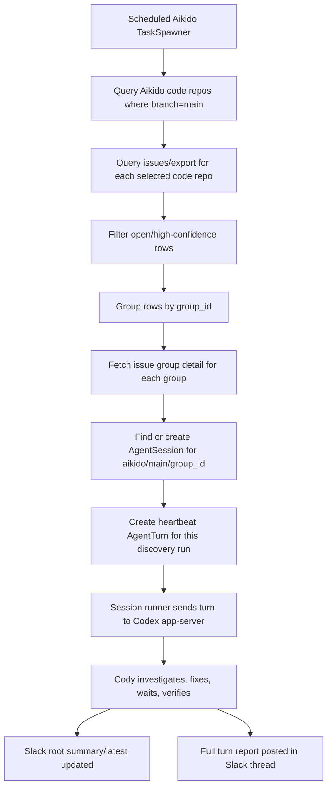

# Cody Aikido Security Fixing Implementation Spec

Status: Draft
Date: 2026-06-08
Scope: Kelos, cody-tools, skills repo, and optional k8s-platform-gitops wiring

## Summary

Build a deterministic Aikido-driven Cody workflow that discovers open security findings on latest `main`, starts or reuses one long-running Cody `AgentSession` per Aikido issue group, and lets that session babysit remediation until the issue is fixed or blocked.

The first workflow should mirror the infra-health babysitter shape that is already working:

- a scheduled TaskSpawner CronJob runs periodically;
- it deterministically discovers work items;
- each work item maps to a stable session;
- each scheduled tick creates a heartbeat turn for active sessions;
- Cody performs investigation, PR creation, follow-up, and verification;
- Slack gets one stable root message per session, with concise summary/latest fields and full turn output in the thread.

The key difference from infra health is work discovery. Infra health is environment-scoped. Aikido security fixing is issue-group-scoped and branch-scoped, with latest `main` as the first target.

## Goals

- Discover open Aikido issues for active code repositories on branch `main`.
- Group work by Aikido `group_id`, not by individual location row.
- Create at most one active Cody `AgentSession` per issue group and branch.
- Add one heartbeat `AgentTurn` per scheduled discovery run for each active issue group.
- Let Cody handle multi-step remediation over multiple turns:
  - identify affected repository or shared package;
  - inspect latest `main`;
  - search existing Cody/security PRs;
  - create or update fix PRs;
  - wait for package/image builds where needed;
  - bump consumers when needed;
  - verify with Aikido again after the fix is available.
- Reuse the generic Kelos `AgentSession` lifecycle. Do not add security-specific session phases.
- Reuse `session-summary-root` Slack UX:
  - root message summary is concise and additive;
  - latest field streams active work;
  - full turn posts go in thread.
- Keep the implementation generic enough that later deterministic sources/controllers can use the same session-spawning path.

## Non-Goals

- No automatic merging.
- No production branch or release-branch remediation in v1.
- No cross-session handoff in v1.
- No global artifact CRD in v1.
- No hard-coded repo ownership logic in Kelos.
- No direct Aikido credentials inside Cody agent workspaces.
- No broad write-through Aikido proxy. Any Aikido mutation must be an explicit allowlisted cody-tools operation.

## Existing Pieces To Reuse

### Kelos Session Runtime

Kelos already has generic session primitives:

- `AgentSession`
  - phases: `Pending`, `Starting`, `Idle`, `Running`, `Closing`, `Closed`, `Error`;
  - source metadata in `spec.source`;
  - generic task template snapshot;
  - max age, idle timeout, context window, and queued turn limits;
  - session-owned Slack root state in `status.slack`.
- `AgentTurn`
  - phases: `Queued`, `Running`, `Succeeded`, `Failed`, `Canceled`;
  - source metadata in `spec.source`;
  - a turn-level prompt sent into the app-server session.
- `session-summary-root` Slack layout
  - already supports stable root message plus thread details.

The new Aikido workflow should not create a separate lifecycle model. A security issue can be “waiting for build”, “waiting for scan”, or “blocked”, but those are Cody/Slack/Jira semantics inside the session output, not Kelos phase values.

### Existing Aikido Source

Kelos already has `when.aikido` and an `AikidoSource`, but the current implementation uses `/open-issue-groups` directly. That is not enough for latest-main scoping because group details can include locations across branches and repositories.

Existing metadata keys should be preserved:

- `aikido.kelos.dev/issue-group-id`
- `aikido.kelos.dev/severity`
- `aikido.kelos.dev/status`
- `aikido.kelos.dev/issue-type`
- `aikido.kelos.dev/repositories`
- `aikido.kelos.dev/url`

The new implementation should use issue export rows for richer prompt context, but should keep Kubernetes labels/annotations intentionally small.

### Implementation Split

This does not require a brand-new Kubernetes controller for Aikido. Kelos already reconciles scheduled `TaskSpawner` objects into CronJobs, and Aikido is already recognized as a scheduled source.

The required changes are:

- **TaskSpawner API/CRD:** add Aikido fields for branch scoping, issue types, schedule deadline, and session mode.
- **TaskSpawner controller:** small scheduling change only, mainly to pass Aikido `startingDeadlineSeconds` into the CronJob.
- **Aikido source:** main implementation change. Replace or augment `/open-issue-groups` discovery with branch-scoped `/repositories/code` plus `/issues/export` grouping.
- **Spawner session path:** add Aikido session/turn creation, similar to cron session mode.
- **Session runner:** add an Aikido turn prompt renderer.
- **Skills repo:** actual repository allowlists, severity filters, schedule, Slack destination, and AgentConfig live in the TaskSpawner manifest there.

### cody-tools Aikido Proxy

`cody-tools` in non-prod already exposes a read-only Aikido proxy backed by `CODY_TOOLS_AIKIDO_API_BASE_URL` and credentials from `cody-aikido-api-client-credentials`.

Live checks confirmed the proxy can read:

- `/repositories/code`
- `/issues/export`
- `/open-issue-groups`
- `/issues/groups/{group_id}`
- `/issues/{issue_id}`

Write operations, including scan retriggering, need explicit confirmation and allowlisting before implementation.

## Live Aikido API Shape

The first implementation should use these endpoints.

### Code Repositories

Request:

```text
GET /repositories/code?filter_branch=main&per_page=<n>&page=<n>
```

Response shape is a top-level array. Important fields:

- `id`
- `name`
- `branch`
- `active`
- `url`
- `last_scanned_at`
- `provider`
- `external_repo_id`
- `connectivity`
- `sensitivity`

Use this endpoint to build the authoritative set of active latest-main code repository IDs.

### Issue Export Rows

Request:

```text
GET /issues/export?filter_status=open&filter_code_repo_id=<code_repo_id>&per_page=<n>&page=<n>
```

Useful optional filters:

- `filter_issue_type=<single_type>`
- status and severity filtering where supported.

Important live behavior:

- The response is a top-level array.
- `filter_issue_type` accepts one value at a time.
- Comma-separated issue types returned HTTP 400 in testing, so Kelos must issue separate requests per type.
- Rows do not include `branch`; branch scoping comes from the `filter_code_repo_id` values discovered from `/repositories/code?filter_branch=main`.

Important fields:

- `id`
- `group_id`
- `status`
- `type`
- `severity`
- `severity_score`
- `code_repo_id`
- `code_repo_name`
- `container_repo_id`
- `container_repo_name`
- `affected_package`
- `installed_version`
- `patched_versions`
- `cve_id`
- `affected_file`
- `start_line`
- `end_line`
- `first_detected_at`
- `rule`
- `rule_id`
- `programming_language`
- `attack_surface`
- `exploitability`
- `sla_days`
- `sla_remediate_by`
- `closed_at`
- `ignored_at`
- `snooze_until`

### Issue Group Detail

Request:

```text
GET /issues/groups/{group_id}
```

Use this as enrichment after export-row grouping. Do not use it as the source of scoping truth because it can include locations outside the latest-main repo set.

Important fields:

- `id`
- `title`
- `description`
- `group_status`
- `severity`
- `severity_score`
- `type`
- `locations`
- `related_cve_ids`
- `how_to_fix`
- `time_to_fix_minutes`

## Runtime Flow



## CRD/API Changes

Extend `TaskSpawnerSpec.when.aikido`.

The repository list and severity filters are runtime configuration, not Kelos code. They should be configured on the Aikido `TaskSpawner` manifest in the skills repo:

```yaml
spec:
  when:
    aikido:
      branch: main
      repositories:
        - template-nestjs-be
        - order-service
      statuses:
        - open
      severities:
        - critical
        - high
```

Rules:

- `repositories` empty means all active Aikido code repositories on the configured branch.
- For initial rollout, use a short explicit repository allowlist.
- `severities` empty keeps compatibility with current behavior, but the security-fixing workflow should explicitly set `critical` and `high`.
- `statuses` should explicitly set `open`.

Current:

```go
type Aikido struct {
    Schedule     string   `json:"schedule,omitempty"`
    Repositories []string `json:"repositories,omitempty"`
    Statuses     []string `json:"statuses,omitempty"`
    Severities   []string `json:"severities,omitempty"`
}
```

Proposed:

```go
type Aikido struct {
    Schedule string `json:"schedule,omitempty"`

    // Branch scopes code repository discovery. Defaults to "main".
    Branch string `json:"branch,omitempty"`

    // Optional repository-name allowlist for pilot rollout.
    // Empty means all active repos for Branch.
    Repositories []string `json:"repositories,omitempty"`

    // Defaults should remain compatibility-safe. The skills workflow should
    // explicitly set ["open"].
    Statuses []string `json:"statuses,omitempty"`

    // The skills workflow should explicitly set ["critical", "high"] for v1.
    Severities []string `json:"severities,omitempty"`

    // Single issue type values. Kelos must call Aikido once per type because
    // the live API rejected comma-separated values.
    IssueTypes []string `json:"issueTypes,omitempty"`

    // Drop late backfilled schedule ticks.
    StartingDeadlineSeconds *int64 `json:"startingDeadlineSeconds,omitempty"`

    // Session mode for long-running remediation.
    Session *AikidoSession `json:"session,omitempty"`
}

type AikidoSession struct {
    Enabled bool `json:"enabled,omitempty"`

    // Defaults to "aikido/{{.Branch}}/{{ index .Metadata \"aikido.kelos.dev/issue-group-id\" }}".
    ScopeTemplate string `json:"scopeTemplate,omitempty"`

    // Suggested v1: 336h or 720h.
    // This must be long enough for package/image rebuild chains.
    MaxAge metav1.Duration `json:"maxAge,omitempty"`

    // Suggested v1: 25h.
    // Keeps sessions alive across daily heartbeats with margin.
    IdleTimeout metav1.Duration `json:"idleTimeout,omitempty"`

    // Suggested v1: 1 or 2.
    // Prevents repeated queued remediation turns for the same issue group.
    MaxQueuedTurns *int32 `json:"maxQueuedTurns,omitempty"`
}
```

Compatibility notes:

- Existing `when.aikido` fields remain valid.
- Existing non-session Aikido behavior should keep working.
- `taskSpawnerSchedule` already supports Aikido schedules.
- `isScheduledSource` already treats Aikido with `schedule` as scheduled.
- `taskSpawnerStartingDeadlineSeconds` must be extended to read `when.aikido.startingDeadlineSeconds`.

## Work Item Model

The spawner should still use `source.WorkItem`, but Aikido session mode needs two identities:

- session identity: stable per issue group and branch;
- turn identity: stable per issue group and discovery run.

Recommended mapping:

- `WorkItem.ID`: stable group ID string, for example `aikido-group-17997122`.
- `WorkItem.Number`: group ID.
- `WorkItem.Kind`: `aikido_issue_group`.
- `WorkItem.Branch`: `main`.
- `WorkItem.Title`: Aikido group title.
- `WorkItem.URL`: Aikido group URL if available.
- `WorkItem.Body`: deterministic prompt input containing:
  - issue group summary;
  - exact scoped issue export rows;
  - latest-main repository list;
  - remediation constraints.
- `WorkItem.Metadata`: small machine-readable identifiers used for session scope, labels/annotations, Slack context, and debugging.

For session turn dedupe, `createAikidoSessionTurn` must not dedupe only on `WorkItem.ID`, otherwise only the first turn would ever be created. It should compute a separate turn source ID:

```text
aikido-group-<group_id>-<scheduled_run_timestamp>
```

The scheduled timestamp should be coarse and deterministic for the CronJob run, for example UTC RFC3339 minute precision. If the spawner process retries inside the same scheduled Job, it must reuse the same timestamp.

## New Aikido Metadata

Keep Kubernetes metadata small. The detailed Aikido issue export rows should be rendered into `WorkItem.Body` and sent to Cody in the turn prompt. They should not be copied wholesale into Kubernetes annotations.

Add only these keys to `WorkItem.Metadata` and copy them into spawned `AgentSession`/`AgentTurn` annotations where useful:

```text
aikido.kelos.dev/branch
aikido.kelos.dev/issue-group-id
aikido.kelos.dev/severity
aikido.kelos.dev/status
aikido.kelos.dev/issue-type
aikido.kelos.dev/code-repositories
aikido.kelos.dev/affected-packages
aikido.kelos.dev/cve-ids
aikido.kelos.dev/url
```

Put these details in the prompt body only:

```text
issue IDs
code repo IDs
container repo IDs/names
installed versions
patched versions
affected files and line ranges
rule IDs
programming language
attack surface
exploitability
SLA/remediate-by dates
first detected timestamps
```

Encoding rules:

- Use comma-separated values only for short scalar lists.
- Keep annotations small. Large row payloads belong in the turn prompt body, not annotations.
- Redact or omit secret values for leaked-secret findings. Include rule ID, file path, and location metadata, but not the secret itself.

## Aikido Source Implementation

### Source Configuration

Extend `source.AikidoSource`.

```go
type AikidoSource struct {
    ProxyBaseURL string
    Repositories []string
    Statuses []string
    Severities []string

    Branch string
    IssueTypes []string
    UseIssueExport bool

    Client *http.Client
}
```

Defaults:

- `Branch`: `main`
- `Statuses`: if empty, preserve current behavior; skills config should explicitly set `open`
- `IssueTypes`: empty means all returned types, but v1 skills config should use an explicit small set
- `UseIssueExport`: true when branch is set, issue types are set, or session mode is enabled

### Discovery Algorithm

1. Discover code repositories:

   ```text
   GET /repositories/code?filter_branch=<branch>&per_page=<pageSize>&page=<page>
   ```

2. Keep only active code repositories.

3. If `repositories` is non-empty, match by repository name.

4. For each selected code repository ID, fetch issue export rows:

   ```text
   GET /issues/export?filter_status=open&filter_code_repo_id=<id>&per_page=<pageSize>&page=<page>
   ```

5. If `issueTypes` is non-empty, make one `/issues/export` request per issue type:

   ```text
   GET /issues/export?filter_issue_type=<type>&filter_status=open&filter_code_repo_id=<id>&...
   ```

6. Dedupe rows by `id`.

7. Apply deterministic in-process filters:

   - row status is configured status;
   - row severity is configured severity;
   - row type is configured issue type, if issue types were configured;
   - row code repo ID is in the branch-scoped repo set.

8. Group rows by `group_id`.

9. Fetch group details:

   ```text
   GET /issues/groups/<group_id>
   ```

10. Build one `WorkItem` per group.

### Body Format

The Aikido work item body should be model-friendly but deterministic:

```markdown
# Aikido Issue Group

Group ID: <group_id>
Branch: main
Severity: <severity>
Type: <type>
Status: open
Title: <title>
URL: <url>

## Group Summary

<description/how_to_fix from group detail, summarized if very large>

## Scoped Issue Rows

These rows are scoped to active code repositories on branch main.

| issue_id | code_repo | package/rule | installed | patched | file | lines |
| ... |

## Constraints

- Work only against latest main unless explicitly instructed otherwise.
- Search for an existing open remediation PR before creating a new one.
- Do not merge PRs.
- If remediation requires shared package or image rebuilds, continue across future turns.
- After the fix is available, verify with Aikido before declaring complete.
```

For leaked secrets, do not render the secret value.

## Spawner Session Changes

### Generic Direction

Cron session mode currently has cron-specific helpers:

- `cronSessionEnabled`
- `effectiveCronSessionConfig`
- `createCronSessionTurn`
- `findOrCreateCronSession`
- `newestActiveCronSession`
- `countQueuedOrRunningCronTurns`

For v1, implement Aikido-specific helpers without prematurely generalizing every scheduled source. After cron and Aikido both work, these can be refactored into a generic scheduled session helper.

Add:

- `aikidoSessionEnabled(ts *TaskSpawner) bool`
- `effectiveAikidoSessionConfig(ts *TaskSpawner) aikidoSessionConfig`
- `createAikidoSessionTurn(...)`
- `findOrCreateAikidoSession(...)`
- `newestActiveAikidoSession(...)`
- `countQueuedOrRunningAikidoTurns(...)` or a generic count helper by session name

Update:

```go
sessionMode := cronSessionEnabled(&ts) || aikidoSessionEnabled(&ts)
```

Then route:

- cron source + cron session -> existing cron path;
- Aikido source + Aikido session -> new Aikido path;
- all other sources -> existing task creation path.

### Session Key

Default Aikido session scope:

```text
aikido/{{.Branch}}/{{ index .Metadata "aikido.kelos.dev/issue-group-id" }}
```

Session labels:

```text
kelos.dev/source=aikido
kelos.dev/taskspawner=<taskspawner-name>
kelos.dev/session-scope-hash=<hash(scope)>
aikido.kelos.dev/branch=main
aikido.kelos.dev/issue-group-id=<group_id>
```

Session source:

```yaml
source:
  type: Aikido
  key: aikido/main/<group_id>
  displayName: aikido:<group_id>
  schedule: <taskspawner schedule>
```

Session name:

```text
<taskspawner-name>-sess-<scope-hash>-g<generation>
```

Generation behavior should mirror cron sessions:

- reuse newest active session;
- if no active session exists and issue is still open, create a new generation.

### Turn Creation

Turn source:

```yaml
source:
  type: AikidoIssueGroup
  id: aikido-group-<group_id>-<scheduled_run_timestamp>
  displayName: <group title>
  time: <scheduled_run_timestamp>
  schedule: <taskspawner schedule>
```

Turn labels:

```text
kelos.dev/source=aikido
kelos.dev/agent-session=<session-name>
kelos.dev/taskspawner=<taskspawner-name>
aikido.kelos.dev/issue-group-id=<group_id>
```

Turn dedupe:

- list turns for the session;
- if a turn with the same source ID exists, skip;
- if any queued/running turn exists and `maxQueuedTurns` would be exceeded, skip;
- do not create multiple turns for the same issue group during the same scheduled run.

This is the main protection against duplicate remediation turns and Slack spam.

## Session Runner Changes

`kelos-session-runner` currently has a cron prompt path for cron sessions and a Slack prompt path for Slack-originated sessions.

Add an Aikido prompt path:

```go
if session.Spec.Source.Type == "Aikido" || turn.Spec.Source.Type == "AikidoIssueGroup" {
    return renderAikidoTurnPrompt(session, turn)
}
```

Prompt requirements:

- Explain that this is a long-running Aikido remediation session.
- Include session key, issue group ID, branch, turn sequence, and schedule.
- Include the full work item body from the source.
- Remind Cody to:
  - search existing PRs/issues first;
  - continue existing remediation rather than duplicate it;
  - create a PR only when there is a concrete fix;
  - wait for build/scan state when needed;
  - update Slack summary concisely;
  - never merge.

The prompt should not embed Aikido credentials. Verification should go through cody-tools or MCP tools available to the runtime.

## Slack Reporting

Use existing session Slack fields and `session-summary-root`.

Task template annotations for the Aikido workflow:

```yaml
kelos.dev/slack-reporting: deferred
kelos.dev/slack-destination: cody-security
kelos.dev/slack-layout: session-summary-root
```

If `cody-security` does not exist yet, start with `cody-devops` and make the alias configurable in the skills manifest.

Expected root message:

```text
cody-aikido-main-security/<group_id>

Summary
Session started.
- Fixed package X in repo Y: PR <url>, waiting for image build.
- Bumped consumer repo Z: PR <url>, waiting for Aikido scan.

Latest
Checking whether Aikido still reports group <group_id> after the latest scan.
```

Full turn output goes in the thread.

## Cody Agent Behavior

The AgentConfig should instruct Cody to follow this loop.

### At Session Start / Every Turn

1. Read the Aikido issue group and scoped issue rows from the turn prompt.
2. Confirm the finding is still open using Aikido reads.
3. Search for existing open PRs using:
   - Aikido group ID;
   - issue IDs;
   - CVE IDs;
   - affected package;
   - repository names.
4. If an existing PR matches, update Slack and continue babysitting that PR.
5. If no PR exists, inspect latest `main` in the affected repo.

### Remediation Decision

Prefer smallest safe fix:

- direct dependency bump in affected repo;
- shared package bump if the vulnerable dependency is inherited;
- base image bump if the issue is in an image layer;
- consumer bump after shared package/image publishes.

If the issue cannot be fixed safely in Git:

- explain why;
- identify the owner/action needed;
- keep the session alive only if future ticks can detect progress.

### PR Creation

Rules:

- use latest `main`;
- conventional commit title;
- include Aikido group ID and issue IDs in PR body;
- include affected package/CVE/severity;
- include tests or explain why not applicable;
- do not create duplicate PRs;
- do not merge.

### Babysitting

On later turns:

- check whether PR is merged;
- check whether package/image build completed;
- if a shared fix merged, bump consumers;
- if consumer fix merged, check whether Aikido scan has observed the fix;
- if scan still reports issue, inspect why and continue;
- if issue is closed, post final concise summary and let the session close naturally.

## Aikido Scan Retrigger

The desired end state includes re-triggering an Aikido scan after remediation.

Current confirmed state:

- read endpoints work through cody-tools;
- scan trigger endpoint and required request shape are not yet confirmed;
- cody-tools should not expose generic POST proxying.

Implementation plan:

1. Confirm the exact Aikido API endpoint for scan retriggering.
2. Add one allowlisted cody-tools operation, for example:

   ```text
   POST /aikido/actions/code-repositories/{repo_id}/scan
   ```

   The final path and payload must match Aikido's real API.

3. Enforce:

   - method and path allowlist;
   - no arbitrary URL passthrough;
   - repository ID must be present;
   - request and response logging must exclude credentials;
   - timeout and bounded response size.

4. Expose the operation to Cody through the same cody-tools mechanism used by other tools.
5. Add prompt guidance: trigger scan only after the relevant PR/build is available, not on every turn.

If the scan endpoint cannot be confirmed before v1 rollout, ship read-based verification first and keep scan retrigger disabled behind a config flag.

## Skills Repo Changes

Add a new skill/workflow directory for the Aikido security babysitter.

Suggested files:

```text
skills/
  cody/
    aikido-security-main/
      agentconfig.yaml
      taskspawner.yaml
      README.md
```

Exact layout should follow the current skills repo conventions.

### AgentConfig

The AgentConfig should:

- use the Codex app-server runtime;
- include GitHub, shell, cody-tools/Aikido access, and Slack reporting tools already used by Cody sessions;
- instruct latest-main remediation only;
- forbid merges;
- include duplicate PR search requirements;
- include shared package/image babysitting workflow;
- include Aikido verification workflow.

### TaskSpawner

This is where operators configure the rollout surface: repository allowlist, severity filters, issue types, schedule, session limits, and Slack destination. Kelos should provide the API and behavior; the skills repo should own these workflow choices.

Initial disabled/pilot manifest:

```yaml
apiVersion: kelos.dev/v1alpha1
kind: TaskSpawner
metadata:
  name: cody-aikido-security-main
  namespace: kelos-system
spec:
  suspend: true
  when:
    aikido:
      schedule: "0 7 * * *"
      branch: main
      statuses: ["open"]
      severities: ["critical", "high"]
      issueTypes: ["open_source", "docker_container", "sast"]
      startingDeadlineSeconds: 300
      repositories:
        - template-nestjs-be
      session:
        enabled: true
        scopeTemplate: 'aikido/{{.Branch}}/{{ index .Metadata "aikido.kelos.dev/issue-group-id" }}'
        maxAge: 336h
        idleTimeout: 25h
        maxQueuedTurns: 1
  taskTemplate:
    metadata:
      annotations:
        kelos.dev/slack-reporting: deferred
        kelos.dev/slack-destination: cody-security
        kelos.dev/slack-layout: session-summary-root
    spec:
      agentConfigRef:
        name: cody-aikido-security-main
```

Rollout should start suspended, then enable one or two repositories before org-wide discovery.

## k8s-platform-gitops Changes

Only needed if cody-tools deployment or secret wiring changes.

Expected v1 needs:

- confirm `CODY_TOOLS_AIKIDO_API_BASE_URL` is present in the target environment;
- confirm `external-secret-cody-aikido-api.yaml` provides the required API credentials;
- if scan retrigger is implemented, add any needed cody-tools env/config for the allowlisted action;
- bump Kelos chart/image versions after Kelos changes are released.

No platform-gitops changes should be needed for the read-only discovery path if current cody-tools wiring is already deployed.

## Kelos Implementation Tasks

### 1. API Types and CRDs

- Extend `api/v1alpha1/taskspawner_types.go`.
- Regenerate CRDs.
- Update generated manifests under `internal/manifests/install-crd.yaml`.
- Add comments for new fields.

### 2. Controller Scheduling

This is a small extension to the existing TaskSpawner controller, not a separate Aikido controller.

- Update `taskSpawnerStartingDeadlineSeconds` to support Aikido.
- Ensure the TaskSpawner CronJob builder passes the deadline to scheduled Aikido sources.
- Verify existing Aikido `--aikido-proxy-url` and cody-tools label behavior still applies.

### 3. Aikido Source

- Add branch-scoped repository discovery.
- Add issue export fetching.
- Add issue type fan-out.
- Add row dedupe.
- Add group-by-group ID.
- Add group detail enrichment.
- Preserve old `/open-issue-groups` path where needed for compatibility.
- Add unit tests with `httptest`.

### 4. Spawner Session Mode

- Add Aikido session config helpers.
- Add Aikido session create/reuse logic.
- Add Aikido turn create/dedupe logic.
- Ensure turn source ID includes scheduled run identity.
- Enforce `maxQueuedTurns`.
- Add tests for:
  - first run creates one session and one turn;
  - second run with same issue group creates a second heartbeat turn;
  - retry in same scheduled run does not create duplicate turn;
  - queued/running turn suppresses new turn when limit is reached;
  - terminal session creates a new generation if issue remains open.

### 5. Session Runner Prompt

- Add `renderAikidoTurnPrompt`.
- Route Aikido sessions/turns to that renderer.
- Add unit tests or golden tests for prompt content.

### 6. cody-tools Scan Action

- Confirm exact Aikido API endpoint first.
- Add allowlisted action only if confirmed.
- Add tests for allowed path, rejected arbitrary path, timeout, and redaction.

### 7. Slack

- No new Slack formatter should be needed.
- Add integration tests only if current session-summary-root behavior needs source-specific coverage.

## Testing Plan

### Unit Tests

Kelos:

- Aikido source:
  - fetch branch code repos;
  - repository allowlist;
  - issue export pagination;
  - issue type fan-out;
  - dedupe duplicate rows;
  - filter status/severity/type;
  - group rows by group ID;
  - enrich with group detail;
  - redact leaked-secret detail.
- Spawner:
  - Aikido session enablement;
  - session scope rendering from metadata;
  - session reuse;
  - generation after terminal session;
  - heartbeat turn dedupe by source ID;
  - `maxQueuedTurns`;
  - Aikido `startingDeadlineSeconds`.
- Session runner:
  - Aikido prompt path selected;
  - prompt includes issue group ID, branch, and scoped rows.
- cody-tools, if scan action is added:
  - allowed scan route;
  - rejected generic POST;
  - credential redaction.

### Manual Cluster Validation

After deployment, with TaskSpawner still suspended:

```bash
kubectl -n kelos-system get taskspawner cody-aikido-security-main -o yaml
kubectl -n kelos-system get cronjob | grep cody-aikido
```

Create one manual job from the CronJob:

```bash
kubectl -n kelos-system create job --from=cronjob/cody-aikido-security-main cody-aikido-security-main-manual-1
```

Watch:

```bash
kubectl -n kelos-system logs job/cody-aikido-security-main-manual-1
kubectl -n kelos-system get agentsessions.kelos.dev -l kelos.dev/source=aikido
kubectl -n kelos-system get agentturns.kelos.dev -l kelos.dev/source=aikido
```

Expected:

- one active session per discovered issue group;
- one queued/running turn per session for the manual run;
- Slack root message per session;
- full report in thread;
- no duplicate root messages for the same session.

## Rollout Plan

1. Kelos PR:
   - CRD/API changes;
   - Aikido source discovery;
   - Aikido session mode;
   - Aikido prompt;
   - tests.

2. Build and publish Kelos images/chart.

3. Apply CRD before chart rollout.

4. k8s-platform-gitops PR if needed:
   - chart/image bump;
   - cody-tools scan action config, if implemented.

5. skills PR:
   - add Aikido AgentConfig;
   - add suspended TaskSpawner;
   - start with one pilot repo.

6. Merge skills PR while suspended.

7. Run one manual job.

8. If behavior is clean, unsuspend daily schedule for pilot repo.

9. Expand repositories only after:
   - session dedupe is proven;
   - Slack root/thread behavior is clean;
   - duplicate PR prevention is proven.

## Acceptance Criteria

- A scheduled Aikido TaskSpawner can discover open critical/high findings on latest `main`.
- Each Aikido group creates one active `AgentSession`.
- Repeated schedule ticks create heartbeat turns in the same session, not new root Slack messages.
- A queued/running turn suppresses additional queued turns when `maxQueuedTurns` is reached.
- Cody can open or babysit a remediation PR without creating duplicates.
- Slack shows one root message per issue-group session and full details in thread.
- The workflow can continue across package/image build waits.
- Aikido verification happens through cody-tools reads, and scan retriggering is either implemented as an allowlisted action or explicitly disabled.

## Open Questions

- Which Slack channel should be used for security remediation: `cody-devops`, a new `cody-security`, or an Aikido/security team channel?
- Should v1 include Jira ticket creation/update, or keep GitHub PR + Slack as the source of truth?
- Which issue types should be enabled first: `open_source`, `docker_container`, `sast`, `leaked_secret`, or a smaller subset?
- What is the exact Aikido API endpoint and payload for re-triggering a scan?
- Should stale closed/ignored Aikido groups automatically close Kelos sessions, or should Cody post a final summary first?
- What repository pilot list should be used before enabling org-wide latest-main remediation?
- How long should sessions stay alive before generation rollover: 14 days, 30 days, or until Aikido closes?
